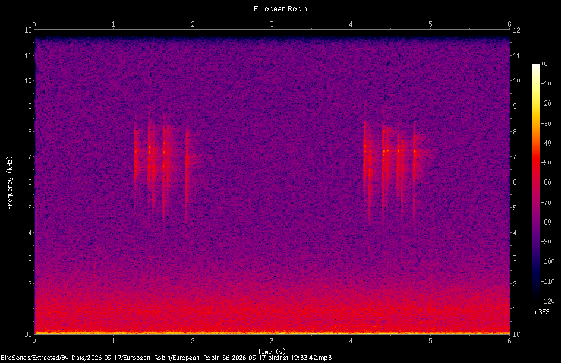

Listen to the birds around you on the trail. Each song is a pressure wave travelling through the air, picked up by your ear (or a microphone) as a single wiggling signal that changes moment to moment. Buried inside that one signal is a mixture of many pure tones at different frequencies, all layered on top of one another -- a blackbird's song is a fast, fluid run through dozens of them.

## Turning a sound into a picture

A short window of any recorded sound can be decomposed into a sum of sine waves of different frequencies. The *Fourier transform* is the tool that performs this decomposition: feed it a chunk of samples, and it hands back how much of each frequency is present.

Do this over and over on a sliding window as the recording plays out, and stack the results side by side, and you get a **spectrogram** -- a picture with time along one axis, frequency along the other, and colour showing how strong each frequency is at each moment. A pure whistled note shows up as a single bright horizontal band. A complex trill, with several frequencies sliding around at once, shows up as a tangle of curved streaks. Birdsong is a particularly rich example: many species sing well above the pitch of human speech, and pack in rapid frequency sweeps that are hard to pick out by ear but leap out immediately in a spectrogram.

There is a Dundee based local community project [Biodiversidee](https://biodiversidee.vercel.app/) tracking bird song using the [Cornell Birdnet-Pi software]( https://birdnet.cornell.edu/birdnet-pi/) - including one running at the Botanic Garden setup by David Martin of the University of Dundee. Here's one of their recordings of a robin:

{height="2in"}

::: {.content-hidden when-format="pdf"}

Press record, then let a birdsong recording (or a whistle, or your own voice) play into the microphone for up to 10 seconds. The app then computes and displays the spectrogram of what it heard, entirely on your own device -- nothing is uploaded anywhere.

- Whistle a single steady note -- you should see one bright, mostly horizontal band.
- Play a recording of a bird call (a phone speaker works fine) and look for rapid up-and-down sweeps -- many songbirds glide between frequencies far faster than a human voice does.
- Compare a low-pitched call (e.g. a pigeon or crow) with a high-pitched one (e.g. a robin or a garden warbler) -- notice how much of the picture is empty space once you're looking at the wrong frequency band for a given bird.
- Try clapping or making a short sharp noise -- broadband, non-tonal sounds like this light up across the *whole* frequency range at once, rather than concentrating in a narrow band.

::: {#fig-birdsong .content-hidden when-format="pdf"}
```{=html}
<style>
  #bird-app, #bird-app * { box-sizing: border-box; }
  /* A CSS grid (rather than flex-wrap) so the frequency sliders can be
     placed independently of the rest of the sidebar -- on a wide screen
     they sit under it in the same column (as before); on a phone they
     move to sit right beside the plots instead (see the media query),
     which needs them to be a separate grid area, not just reordered. */
  #bird-app {
    display: grid;
    grid-template-columns: minmax(280px, 640px) 240px;
    grid-template-rows: auto auto;
    grid-template-areas:
      "canvas sidebar"
      "canvas freq";
    gap: 14px;
    align-items: start;
    font-family: -apple-system, BlinkMacSystemFont, 'Segoe UI', Helvetica, Arial, sans-serif;
    max-width: 1080px;
    text-align: left;
  }
  #bird-app .bird-canvas-wrap {
    grid-area: canvas;
    min-width: 0;
  }
  #bird-app .bird-sidebar {
    grid-area: sidebar;
    min-width: 0;
  }
  #bird-app .bird-freq-col {
    grid-area: freq;
    min-width: 0;
  }
  #bird-app h5 {
    margin: 0 0 8px 0;
    font-size: 14px;
  }
  #bird-app #bird-status {
    font-size: 13px;
    line-height: 1.5;
    margin-bottom: 8px;
    min-height: 2.4em;
  }
  #bird-app #bird-status.bird-error { color: #b3261e; }
  #bird-app button#bird-record {
    display: inline-block;
    padding: 9px 18px;
    font-size: 14px;
    font-weight: 600;
    border-radius: 4px;
    cursor: pointer;
    background: #2f7d4f;
    color: #fff;
    border: none;
    margin-bottom: 8px;
  }
  #bird-app button#bird-record:active { background: #245e3d; }
  #bird-app button#bird-record:disabled { background: #9bbca8; cursor: default; }
  #bird-app .bird-progress-wrap {
    width: 100%;
    height: 8px;
    border-radius: 4px;
    background: #e4e4e4;
    overflow: hidden;
    margin: 4px 0 16px 0;
  }
  #bird-app .bird-progress-bar {
    height: 100%;
    width: 0%;
    background: #2f7d4f;
  }
  #bird-app fieldset {
    border: none;
    padding: 0;
    margin: 0 0 12px 0;
  }
  #bird-app legend {
    font-size: 12.5px;
    font-weight: 600;
    padding: 0;
    margin-bottom: 4px;
  }
  #bird-app label {
    display: block;
    font-size: 13px;
    line-height: 1.4;
    cursor: pointer;
    margin: 3px 0;
  }
  #bird-app label input[type="radio"] {
    margin-right: 6px;
    vertical-align: middle;
  }
  #bird-app .bird-slider-row { margin: 8px 0; }
  #bird-app .bird-slider-row .bird-slider-label {
    display: flex;
    justify-content: space-between;
    font-size: 12.5px;
    margin-bottom: 2px;
  }
  #bird-app .bird-slider-row input[type="range"] { width: 100%; }
  #bird-app select {
    font-size: 13px;
    padding: 3px;
  }
  #bird-app .bird-plot-label {
    font-size: 11.5px;
    color: #666;
    margin: 2px 0 3px 0;
  }
  #bird-wave-canvas {
    width: 100%;
    height: auto;
    display: block;
    border-radius: 6px;
    background: #0d0626;
    margin-bottom: 10px;
  }
  #bird-canvas {
    width: 100%;
    height: auto;
    display: block;
    border-radius: 6px;
    background: #0d0626;
  }
  #bird-app .bird-colorbar-wrap {
    margin-top: 8px;
    font-size: 11.5px;
    color: #666;
  }
  #bird-app .bird-colorbar {
    height: 10px;
    border-radius: 3px;
    margin-bottom: 3px;
    background: linear-gradient(to right, rgb(13,8,38), rgb(46,15,90), rgb(110,25,110), rgb(180,45,80), rgb(235,100,40), rgb(250,175,40), rgb(252,240,100));
  }
  #bird-app .bird-colorbar-labels {
    display: flex;
    justify-content: space-between;
  }
  /* On a phone screen, the frequency sliders need to sit right beside
     the plots they affect, small, so dragging one and watching its
     effect on the picture never needs a scroll in between. The record
     button/status/scale toggle aren't something you watch update live
     in the same way, so they move to a full-width strip underneath
     instead. The sliders themselves are turned on their side (rotated
     90 degrees) so two of them fit in a narrow column next to the
     image rather than each needing the full screen width. */
  @media (max-width: 640px) {
    #bird-app {
      gap: 8px;
      grid-template-columns: 1fr 74px;
      grid-template-areas:
        "canvas freq"
        "sidebar sidebar";
    }
    #bird-app h5 { display: none; }
    #bird-app #bird-status { font-size: 12px; margin-bottom: 4px; min-height: 2.1em; }
    #bird-app button#bird-record { padding: 7px 14px; margin-bottom: 4px; }
    #bird-app .bird-progress-wrap { margin: 3px 0 6px 0; }
    #bird-app fieldset {
      display: flex;
      flex-wrap: wrap;
      align-items: center;
      gap: 3px 16px;
      margin: 0 0 6px 0;
    }
    #bird-app legend { flex-basis: 100%; margin-bottom: 1px; }
    #bird-app fieldset label { margin: 0; }
    #bird-app .bird-plot-label { font-size: 10.5px; line-height: 1.25; margin: 1px 0 2px 0; }
    #bird-wave-canvas { margin-bottom: 6px; }
    #bird-app .bird-colorbar-wrap { margin-top: 5px; }

    /* Frequency column: two small rotated sliders, side by side, next
       to the plots instead of two full-width bars underneath them. */
    #bird-app .bird-freq-col {
      display: flex;
      justify-content: center;
      align-items: center;
      gap: 4px;
      height: 100%;
      padding-top: 18px;
    }
    #bird-app .bird-freq-col .bird-slider-row {
      margin: 0;
      display: flex;
      flex-direction: column;
      align-items: center;
      width: 34px;
    }
    #bird-app .bird-freq-col .bird-slider-label {
      display: block;
      font-size: 8.5px;
      line-height: 1.15;
      text-align: center;
      margin-bottom: 4px;
    }
    /* Hide the descriptive "Min frequency" / "Max frequency" text on
       this narrow column -- only the live numeric value is shown, right
       above its slider; the full wording is still there on a wider
       screen where there's room for it. */
    #bird-app .bird-freq-col .bird-slider-label span:first-child { display: none; }
    #bird-app .bird-vslider-outer {
      position: relative;
      width: 34px;
      height: 120px;
    }
    #bird-app .bird-vslider-outer input[type="range"] {
      position: absolute;
      top: 50%;
      left: 50%;
      width: 120px;
      height: 26px;
      margin-top: -13px;
      margin-left: -60px;
      transform: rotate(-90deg);
    }
  }
</style>

<div id="bird-app">
  <div class="bird-canvas-wrap">
    <div class="bird-plot-label">The raw recording -- amplitude vs time. One tangled wiggle, hard to read directly.</div>
    <canvas id="bird-wave-canvas" width="900" height="90"></canvas>
    <div class="bird-plot-label">The same recording, decomposed into the frequencies it's built from -- the spectrum.</div>
    <canvas id="bird-canvas" width="900" height="420"></canvas>
    <div class="bird-colorbar-wrap">
      <div class="bird-colorbar"></div>
      <div class="bird-colorbar-labels">
        <span id="bird-db-min">quiet</span>
        <span>Power</span>
        <span id="bird-db-max">loud</span>
      </div>
    </div>
  </div>
  <div class="bird-sidebar">
    <h5>Record &amp; explore</h5>
    <button id="bird-record" type="button">Record (up to 10s)</button>
    <div class="bird-progress-wrap"><div class="bird-progress-bar" id="bird-progress"></div></div>
    <div id="bird-status">Tap Record, then let a sound (birdsong, a whistle, your voice) play into the microphone.</div>

    <fieldset>
      <legend>Frequency scale</legend>
      <label><input type="radio" name="bird-scale" value="linear" checked> Linear</label>
      <label><input type="radio" name="bird-scale" value="log"> Logarithmic</label>
    </fieldset>
  </div>
  <div class="bird-freq-col">
    <div class="bird-slider-row">
      <div class="bird-slider-label"><span>Min frequency</span><span id="bird-minfreq-value">200 Hz</span></div>
      <div class="bird-vslider-outer">
        <input type="range" id="bird-minfreq" min="0" max="5000" step="50" value="200">
      </div>
    </div>
    <div class="bird-slider-row">
      <div class="bird-slider-label"><span>Max frequency</span><span id="bird-maxfreq-value">10000 Hz</span></div>
      <div class="bird-vslider-outer">
        <input type="range" id="bird-maxfreq" min="1000" max="20000" step="100" value="10000">
      </div>
    </div>
  </div>
</div>

<script>
(function () {
  "use strict";
  if (window.SHOW_JS_APPS === false) return;

  var root = document.getElementById("bird-app");
  if (!root) return;

  // -------------------------------------------------------------------
  // Birdsong spectrogram, ported from the Python/Shinylive version
  // (PythonForApps/birdsong_py.qmd) to plain JavaScript + <canvas>.
  // Records from the microphone, then computes and draws a spectrogram
  // (a short-time Fourier transform) entirely in the browser -- no
  // Python runtime, no upload of any audio.
  //
  // Two deliberate improvements over both the Python original and the
  // raw JS recording snippet it was based on:
  //
  //  1. Samples are written straight into a pre-allocated Float32Array
  //     with a running write index, rather than concatenated on every
  //     incoming chunk -- avoids the O(n^2) cost that a per-chunk
  //     np.concatenate() has over a ~10 second recording.
  //  2. The microphone's ScriptProcessorNode is routed to the speakers
  //     through a silent (gain = 0) node rather than connected directly
  //     -- Web Audio requires the node to reach a destination to keep
  //     firing, but connecting it straight to the speakers would cause
  //     an audible live echo of whoever is talking into the microphone.
  // -------------------------------------------------------------------

  var RECORD_SECONDS = 10;
  // Fixed rather than exposed as sliders: 1024 samples gives a good
  // time/frequency trade-off for birdsong (fine enough frequency
  // resolution without smearing out the fast trills), and 70% overlap
  // keeps the spectrogram looking smooth rather than blocky, without
  // materially changing what's visible. Neither needs to be a knob a
  // visitor has to understand.
  var WINDOW_SIZE = 1024;
  var OVERLAP_PCT = 70;

  // ---- small power-of-two FFT (iterative radix-2 Cooley-Tukey) ----
  function fft(re, im) {
    var n = re.length;
    if (n <= 1) return;
    for (var i = 1, j = 0; i < n; i++) {
      var bit = n >> 1;
      for (; j & bit; bit >>= 1) j ^= bit;
      j ^= bit;
      if (i < j) {
        var tr = re[i]; re[i] = re[j]; re[j] = tr;
        var ti = im[i]; im[i] = im[j]; im[j] = ti;
      }
    }
    for (var len = 2; len <= n; len <<= 1) {
      var ang = -2 * Math.PI / len;
      var wr = Math.cos(ang), wi = Math.sin(ang);
      for (var i2 = 0; i2 < n; i2 += len) {
        var curWr = 1, curWi = 0;
        for (var j2 = 0; j2 < len / 2; j2++) {
          var ur = re[i2 + j2], ui = im[i2 + j2];
          var vr = re[i2 + j2 + len / 2] * curWr - im[i2 + j2 + len / 2] * curWi;
          var vi = re[i2 + j2 + len / 2] * curWi + im[i2 + j2 + len / 2] * curWr;
          re[i2 + j2] = ur + vr; im[i2 + j2] = ui + vi;
          re[i2 + j2 + len / 2] = ur - vr; im[i2 + j2 + len / 2] = ui - vi;
          var nwr = curWr * wr - curWi * wi;
          var nwi = curWr * wi + curWi * wr;
          curWr = nwr; curWi = nwi;
        }
      }
    }
  }

  function computeSpectrogram(samples, sampleRate, windowSize, hopSize) {
    var numFrames = Math.max(0, Math.floor((samples.length - windowSize) / hopSize) + 1);
    var numBins = windowSize / 2;
    var hann = new Float32Array(windowSize);
    for (var i = 0; i < windowSize; i++) {
      hann[i] = 0.5 - 0.5 * Math.cos(2 * Math.PI * i / (windowSize - 1));
    }
    var frames = [];
    var re = new Float32Array(windowSize);
    var im = new Float32Array(windowSize);
    for (var f = 0; f < numFrames; f++) {
      var start = f * hopSize;
      for (var i = 0; i < windowSize; i++) {
        re[i] = samples[start + i] * hann[i];
        im[i] = 0;
      }
      fft(re, im);
      var powers = new Float32Array(numBins + 1);
      for (var k = 0; k <= numBins; k++) {
        var mag2 = re[k] * re[k] + im[k] * im[k];
        powers[k] = 10 * Math.log10(mag2 + 1e-10);
      }
      frames.push(powers);
    }
    return { frames: frames, numBins: numBins, freqStep: sampleRate / windowSize, numFrames: numFrames };
  }

  // ---- colour map (dark purple -> magenta -> orange -> pale yellow) ----
  var CMAP_STOPS = [
    [0.00, 13, 8, 38],
    [0.15, 46, 15, 90],
    [0.35, 110, 25, 110],
    [0.55, 180, 45, 80],
    [0.75, 235, 100, 40],
    [0.90, 250, 175, 40],
    [1.00, 252, 240, 100]
  ];
  function colormapRGB(t) {
    t = t < 0 ? 0 : (t > 1 ? 1 : t);
    for (var i = 0; i < CMAP_STOPS.length - 1; i++) {
      var a = CMAP_STOPS[i], b = CMAP_STOPS[i + 1];
      if (t <= b[0]) {
        var span = b[0] - a[0];
        var f = span > 0 ? (t - a[0]) / span : 0;
        return [
          Math.round(a[1] + f * (b[1] - a[1])),
          Math.round(a[2] + f * (b[2] - a[2])),
          Math.round(a[3] + f * (b[3] - a[3]))
        ];
      }
    }
    var last = CMAP_STOPS[CMAP_STOPS.length - 1];
    return [last[1], last[2], last[3]];
  }

  function init() {
    var canvas = root.querySelector("#bird-canvas");
    var ctx = canvas.getContext("2d");
    var waveCanvas = root.querySelector("#bird-wave-canvas");
    var waveCtx = waveCanvas.getContext("2d");
    var statusDiv = root.querySelector("#bird-status");
    var recordBtn = root.querySelector("#bird-record");
    var progressBar = root.querySelector("#bird-progress");
    var scaleRadios = root.querySelectorAll('input[name="bird-scale"]');
    var minFreqSlider = root.querySelector("#bird-minfreq");
    var maxFreqSlider = root.querySelector("#bird-maxfreq");
    var minFreqValue = root.querySelector("#bird-minfreq-value");
    var maxFreqValue = root.querySelector("#bird-maxfreq-value");
    var dbMinLabel = root.querySelector("#bird-db-min");
    var dbMaxLabel = root.querySelector("#bird-db-max");

    var W = canvas.width, H = canvas.height;
    var marginLeft = 56, marginRight = 14, marginTop = 14, marginBottom = 40;
    var plotW = W - marginLeft - marginRight;
    var plotH = H - marginTop - marginBottom;

    var audioContext = null;
    var mediaStream = null;
    var sourceNode = null;
    var processorNode = null;
    var silentGain = null;
    var recording = false;
    var recordBuffer = null;   // pre-allocated Float32Array
    var writeIndex = 0;
    var capturedAudio = null;  // Float32Array once a recording is complete
    var capturedSampleRate = 44100;

    function setStatus(msg, isError) {
      statusDiv.textContent = msg;
      statusDiv.classList.toggle("bird-error", !!isError);
    }

    function getScale() {
      var checked = root.querySelector('input[name="bird-scale"]:checked');
      return checked ? checked.value : "linear";
    }

    function getMinFreq() { return parseFloat(minFreqSlider.value); }
    function getMaxFreq() { return parseFloat(maxFreqSlider.value); }

    function clampFreqRange() {
      var lo = getMinFreq(), hi = getMaxFreq();
      if (hi - lo < 50) {
        if (this === maxFreqSlider) {
          maxFreqSlider.value = Math.min(20000, lo + 50);
        } else {
          minFreqSlider.value = Math.max(0, hi - 50);
        }
      }
      minFreqValue.textContent = Math.round(getMinFreq()) + " Hz";
      maxFreqValue.textContent = Math.round(getMaxFreq()) + " Hz";
    }

    // -----------------------------------------------------------------
    // Drawing
    // -----------------------------------------------------------------

    function freqToYFactory(minFreq, maxFreq, scale) {
      if (scale === "log") {
        var loLog = Math.log(Math.max(minFreq, 1));
        var hiLog = Math.log(Math.max(maxFreq, minFreq + 1));
        return function (hz) {
          var hzClamped = Math.max(hz, 1);
          var frac = (Math.log(hzClamped) - loLog) / (hiLog - loLog);
          return marginTop + plotH * (1 - frac);
        };
      }
      return function (hz) {
        var frac = (hz - minFreq) / (maxFreq - minFreq);
        return marginTop + plotH * (1 - frac);
      };
    }

    function drawEmpty(message) {
      ctx.clearRect(0, 0, W, H);
      ctx.fillStyle = "#0d0626";
      ctx.fillRect(0, 0, W, H);
      ctx.fillStyle = "rgba(255,255,255,0.7)";
      ctx.font = "14px -apple-system, BlinkMacSystemFont, 'Segoe UI', Helvetica, Arial, sans-serif";
      ctx.textAlign = "center";
      ctx.textBaseline = "middle";
      ctx.fillText(message, W / 2, H / 2);
      dbMinLabel.textContent = "quiet";
      dbMaxLabel.textContent = "loud";
    }

    // Draws the raw waveform (amplitude vs time) as a min/max envelope,
    // one column per pixel -- the standard way audio editors show a
    // waveform without plotting every individual sample. This is what
    // the spectrogram below is computed *from*: on its own it's just a
    // messy line, which is the point -- the spectrum is what makes the
    // frequency content of that line readable.
    function drawWaveform(samples, sampleRate) {
      var WW = waveCanvas.width, WH = waveCanvas.height;
      waveCtx.clearRect(0, 0, WW, WH);
      waveCtx.fillStyle = "#0d0626";
      waveCtx.fillRect(0, 0, WW, WH);

      if (!samples || samples.length < 2) {
        waveCtx.fillStyle = "rgba(255,255,255,0.55)";
        waveCtx.font = "12px -apple-system, BlinkMacSystemFont, 'Segoe UI', Helvetica, Arial, sans-serif";
        waveCtx.textAlign = "center";
        waveCtx.textBaseline = "middle";
        waveCtx.fillText("No recording yet", WW / 2, WH / 2);
        return;
      }

      var mid = WH / 2;
      var halfH = WH / 2 - 4;
      waveCtx.strokeStyle = "rgba(255,255,255,0.2)";
      waveCtx.lineWidth = 1;
      waveCtx.beginPath();
      waveCtx.moveTo(0, mid);
      waveCtx.lineTo(WW, mid);
      waveCtx.stroke();

      var samplesPerPixel = samples.length / WW;
      waveCtx.fillStyle = "#8ecbff";
      for (var x = 0; x < WW; x++) {
        var startIdx = Math.floor(x * samplesPerPixel);
        var endIdx = Math.max(startIdx + 1, Math.floor((x + 1) * samplesPerPixel));
        if (endIdx > samples.length) endIdx = samples.length;
        var mn = 1, mx = -1;
        for (var i = startIdx; i < endIdx; i++) {
          var v = samples[i];
          if (v < mn) mn = v;
          if (v > mx) mx = v;
        }
        if (mn > mx) { mn = 0; mx = 0; }
        var y1 = mid - mx * halfH;
        var y2 = mid - mn * halfH;
        waveCtx.fillRect(x, y1, 1, Math.max(1, y2 - y1));
      }

      var totalDuration = samples.length / sampleRate;
      waveCtx.fillStyle = "rgba(255,255,255,0.7)";
      waveCtx.font = "11px -apple-system, BlinkMacSystemFont, 'Segoe UI', Helvetica, Arial, sans-serif";
      waveCtx.textBaseline = "top";
      waveCtx.textAlign = "left";
      waveCtx.fillText("0s", 3, 3);
      waveCtx.textAlign = "right";
      waveCtx.fillText(totalDuration.toFixed(1) + "s", WW - 3, 3);
    }

    function drawAxes(minFreq, maxFreq, scale, totalDuration) {
      ctx.strokeStyle = "rgba(255,255,255,0.35)";
      ctx.fillStyle = "rgba(255,255,255,0.85)";
      ctx.font = "11px -apple-system, BlinkMacSystemFont, 'Segoe UI', Helvetica, Arial, sans-serif";
      ctx.lineWidth = 1;

      var freqToY = freqToYFactory(minFreq, maxFreq, scale);

      // frequency ticks
      ctx.textAlign = "right";
      ctx.textBaseline = "middle";
      for (var i = 0; i <= 4; i++) {
        var frac = i / 4;
        var freq;
        if (scale === "log") {
          var loLog = Math.log(Math.max(minFreq, 1));
          var hiLog = Math.log(Math.max(maxFreq, minFreq + 1));
          freq = Math.exp(hiLog - frac * (hiLog - loLog));
        } else {
          freq = maxFreq - frac * (maxFreq - minFreq);
        }
        var y = marginTop + plotH * frac;
        ctx.beginPath();
        ctx.moveTo(marginLeft - 4, y);
        ctx.lineTo(marginLeft, y);
        ctx.stroke();
        ctx.fillText(Math.round(freq), marginLeft - 7, y);
      }

      // time ticks
      ctx.textAlign = "center";
      ctx.textBaseline = "top";
      for (var j = 0; j <= 4; j++) {
        var tfrac = j / 4;
        var tsec = tfrac * totalDuration;
        var x = marginLeft + plotW * tfrac;
        ctx.beginPath();
        ctx.moveTo(x, marginTop + plotH);
        ctx.lineTo(x, marginTop + plotH + 4);
        ctx.stroke();
        ctx.fillText(tsec.toFixed(1), x, marginTop + plotH + 6);
      }

      ctx.textAlign = "center";
      ctx.textBaseline = "alphabetic";
      ctx.fillText("Time (s)", marginLeft + plotW / 2, H - 4);

      ctx.save();
      ctx.translate(12, marginTop + plotH / 2);
      ctx.rotate(-Math.PI / 2);
      ctx.textAlign = "center";
      ctx.fillText("Frequency (Hz)", 0, 0);
      ctx.restore();
    }

    function render() {
      if (!capturedAudio || capturedAudio.length < 32) {
        drawEmpty(capturedAudio ? "Recording too short" : "No recording yet");
        return;
      }

      var windowSize = WINDOW_SIZE;
      var hopSize = Math.max(1, Math.round(windowSize * (1 - OVERLAP_PCT / 100)));

      if (capturedAudio.length < windowSize) {
        drawEmpty("Recording too short for this window size");
        return;
      }

      var spec = computeSpectrogram(capturedAudio, capturedSampleRate, windowSize, hopSize);
      if (spec.numFrames === 0) {
        drawEmpty("Recording too short for this window size");
        return;
      }

      var scale = getScale();
      var minFreq = getMinFreq();
      var maxFreq = Math.min(getMaxFreq(), capturedSampleRate / 2);
      if (maxFreq <= minFreq) maxFreq = minFreq + 1;

      var binMin = Math.max(0, Math.floor(minFreq / spec.freqStep));
      var binMax = Math.min(spec.numBins, Math.ceil(maxFreq / spec.freqStep) + 1);
      if (binMax <= binMin) binMax = binMin + 1;

      var dbMax = -Infinity;
      for (var f = 0; f < spec.numFrames; f++) {
        var fr = spec.frames[f];
        for (var k = binMin; k < binMax; k++) {
          if (fr[k] > dbMax) dbMax = fr[k];
        }
      }
      if (!isFinite(dbMax)) dbMax = 0;
      var dbMin = dbMax - 60;

      ctx.clearRect(0, 0, W, H);
      ctx.fillStyle = "#0d0626";
      ctx.fillRect(0, 0, W, H);

      var rowCanvas = document.createElement("canvas");
      rowCanvas.width = Math.max(1, spec.numFrames);
      rowCanvas.height = 1;
      var rowCtx = rowCanvas.getContext("2d");
      var rowImg = rowCtx.createImageData(rowCanvas.width, 1);

      var freqToY = freqToYFactory(minFreq, maxFreq, scale);

      ctx.save();
      ctx.beginPath();
      ctx.rect(marginLeft, marginTop, plotW, plotH);
      ctx.clip();

      for (var kk = binMin; kk < binMax; kk++) {
        for (var ff = 0; ff < spec.numFrames; ff++) {
          var db = spec.frames[ff][kk];
          var t = (db - dbMin) / (dbMax - dbMin);
          var c = colormapRGB(t);
          var idx = ff * 4;
          rowImg.data[idx] = c[0];
          rowImg.data[idx + 1] = c[1];
          rowImg.data[idx + 2] = c[2];
          rowImg.data[idx + 3] = 255;
        }
        rowCtx.putImageData(rowImg, 0, 0);
        var freqLo = kk * spec.freqStep, freqHi = (kk + 1) * spec.freqStep;
        var yTop = freqToY(freqHi), yBottom = freqToY(freqLo);
        var destH = Math.max(1, yBottom - yTop);
        ctx.drawImage(rowCanvas, 0, 0, rowCanvas.width, 1, marginLeft, yTop, plotW, destH);
      }
      ctx.restore();

      var totalDuration = capturedAudio.length / capturedSampleRate;
      drawAxes(minFreq, maxFreq, scale, totalDuration);

      dbMinLabel.textContent = Math.round(dbMin) + " dB";
      dbMaxLabel.textContent = Math.round(dbMax) + " dB";
    }

    // -----------------------------------------------------------------
    // Recording
    // -----------------------------------------------------------------

    function stopRecording(completed) {
      recording = false;
      if (processorNode) { try { processorNode.disconnect(); } catch (e) {} }
      if (sourceNode) { try { sourceNode.disconnect(); } catch (e) {} }
      if (silentGain) { try { silentGain.disconnect(); } catch (e) {} }
      if (mediaStream) {
        mediaStream.getTracks().forEach(function (track) { track.stop(); });
      }
      recordBtn.disabled = false;
      recordBtn.textContent = "Record again (up to 10s)";

      if (completed && writeIndex > 0) {
        capturedAudio = recordBuffer.subarray(0, writeIndex);
        var seconds = writeIndex / capturedSampleRate;
        setStatus("Recording complete. " + seconds.toFixed(1) + " seconds captured.", false);
        drawWaveform(capturedAudio, capturedSampleRate);
        render();
      }
      progressBar.style.width = "0%";
    }

    function onAudioProcess(e) {
      if (!recording || !recordBuffer) return;
      var input = e.inputBuffer.getChannelData(0);
      var remaining = recordBuffer.length - writeIndex;
      var n = Math.min(input.length, remaining);
      if (n > 0) {
        recordBuffer.set(input.subarray(0, n), writeIndex);
        writeIndex += n;
      }
      var frac = writeIndex / recordBuffer.length;
      progressBar.style.width = (100 * frac) + "%";
      setStatus("Recording... " + (writeIndex / capturedSampleRate).toFixed(1) + "s / " + RECORD_SECONDS + "s", false);
      if (writeIndex >= recordBuffer.length) {
        stopRecording(true);
      }
    }

    async function startRecording() {
      if (recording) return;

      if (!navigator.mediaDevices || !navigator.mediaDevices.getUserMedia) {
        setStatus("This browser (or this page, if not loaded over https) can't access the microphone.", true);
        return;
      }

      recordBtn.disabled = true;
      setStatus("Requesting microphone access...", false);

      try {
        // Created synchronously (before the await below) so the click
        // gesture that triggered this still "counts" for browsers that
        // require a user gesture before audio can start.
        var AC = window.AudioContext || window.webkitAudioContext;
        audioContext = new AC();
        if (audioContext.state === "suspended") {
          try { await audioContext.resume(); } catch (e) {}
        }

        mediaStream = await navigator.mediaDevices.getUserMedia({ audio: true });

        capturedSampleRate = audioContext.sampleRate || 44100;
        recordBuffer = new Float32Array(Math.round(capturedSampleRate * RECORD_SECONDS));
        writeIndex = 0;
        capturedAudio = null;

        sourceNode = audioContext.createMediaStreamSource(mediaStream);
        processorNode = audioContext.createScriptProcessor(4096, 1, 1);
        // Route through a silent gain node rather than straight to the
        // speakers -- keeps the processor pumping (required by the Web
        // Audio spec) without an audible live-mic echo in the room.
        silentGain = audioContext.createGain();
        silentGain.gain.value = 0;
        sourceNode.connect(processorNode);
        processorNode.connect(silentGain);
        silentGain.connect(audioContext.destination);
        processorNode.onaudioprocess = onAudioProcess;

        recording = true;
        recordBtn.disabled = true;
        setStatus("Recording... 0.0s / " + RECORD_SECONDS + "s", false);
      } catch (err) {
        recording = false;
        recordBtn.disabled = false;
        setStatus("Microphone error: " + (err && err.message ? err.message : err), true);
      }
    }

    recordBtn.addEventListener("click", startRecording);

    scaleRadios.forEach(function (r) { r.addEventListener("change", render); });
    minFreqSlider.addEventListener("change", function () { clampFreqRange.call(minFreqSlider); render(); });
    maxFreqSlider.addEventListener("change", function () { clampFreqRange.call(maxFreqSlider); render(); });
    minFreqSlider.addEventListener("input", function () { minFreqValue.textContent = Math.round(getMinFreq()) + " Hz"; });
    maxFreqSlider.addEventListener("input", function () { maxFreqValue.textContent = Math.round(getMaxFreq()) + " Hz"; });

    drawEmpty("No recording yet");
    drawWaveform(null, capturedSampleRate);
  }

  init();
})();
</script>
```

Tap Record in the sidebar, then let a sound play into the microphone. The top strip fills in with the raw recording as it happens; the picture below it is the same recording run through the Fourier transform, filling in from left to right as it goes.
:::

:::
