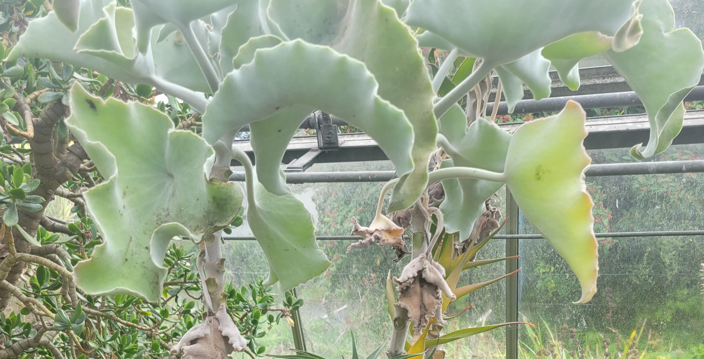

Why are some leaves more wrinkled than others? And what causes this to happen?

Consider a sphere. The surface area is $4\pi R ^2$. Now imagine distorting the sphere so that is wrinkled. The surface area will now be larger.

In the plant at this stop, notice that the leaves are wrinkled rather than smooth.


A question that then arises is how biology can make wrinkled surfaces? One way to do this is using differential growth rates. Essentially, take a smooth surface and allow one part of it to grow at a faster rate than the other whilst keeping the surface as a single connected object. The effect of the differential growth is that the faster growing region wrinkles. 


::: {#fig-leaf-growth}
```{shinylive-python}
#| standalone: true
#| components: [viewer]
#| viewerHeight: 720

## file: app.py
import math

import numpy as np
import matplotlib.pyplot as plt
from mpl_toolkits.mplot3d import Axes3D  # noqa: F401 -- registers the 3d projection

from shiny import App, Inputs, Outputs, Session, render, ui

# ---------------------------------------------------------------------------
# Differential growth in a disc, and why it forces a leaf to crinkle.
#
# Model a leaf as a flat circular disc of reference (un-grown) radius R.
# Growth is isotropic but radius-dependent: a small ring at reference
# radius rho grows by a local linear factor gamma(rho) >= 1. If gamma is
# the same everywhere (gamma == 1 uniformly, or any constant), every ring
# grows by the same factor and the disc simply scales up -- it stays flat.
#
# But if the outer rim grows *faster* than the interior (gamma increasing
# with rho), each ring near the rim needs more circumferential length than
# a flat disc of that same projected radius can supply. There is no way to
# fit that extra length into a flat plane -- the ring is forced out of
# plane, rippling up and down around its circumference to "store" the
# extra length. This is exactly the mechanism behind real crinkled leaves,
# lettuce, and torn plastic sheets (Sharon, Marder & Swinney, "Leaves,
# flowers and garbage bags: Making waves", 2004; Klein, Efrati & Sharon,
# "Shaping of Elastic Sheets by Prescription of Non-Euclidean Metrics",
# 2007) -- non-uniform growth prescribes a target metric with nonzero
# Gaussian curvature, which cannot be isometrically embedded in a flat
# plane, so the sheet buckles into the third dimension instead.
#
# This app is a deliberately simplified, honest proxy for that mechanism,
# not a solved elasticity equilibrium: rings are kept at their flat
# projected radius rho, and each ring independently ripples out of plane,
# sinusoidally, just enough to supply its own required extra length. A
# real leaf would also redistribute the excess elastically between
# neighbouring rings and in general would not settle on a clean sin(m*phi)
# pattern -- but the qualitative story (uniform growth = flat, rim-biased
# growth = forced rippling, and more excess growth = taller ripples) is
# the same one the real physics produces.
# ---------------------------------------------------------------------------

R = 1.0  # reference (un-grown) disc radius -- fixed; only its shape matters
PROFILE_EXPONENT = 3.0  # how concentrated the extra growth is near the rim
N_RADIAL = 36
N_AZIMUTHAL = 140
N_QUAD = 120  # quadrature points used for each arc-length integral


def growth_profile(rho, k_rim):
    """Local growth multiplier gamma(rho): 1 at the centre, k_rim at the
    rim, rising smoothly (as (rho/R)**PROFILE_EXPONENT) so growth is
    concentrated near the outer edge -- matching real leaf margins, which
    are usually where crinkling is most visible."""
    return 1.0 + (k_rim - 1.0) * (rho / R) ** PROFILE_EXPONENT


def loop_arclength(rho, amplitude, m):
    """The true 3D length of the ring at projected radius rho, rippled as
    z(phi) = amplitude * sin(m * phi). Computed by numerical quadrature of
    ds/dphi = sqrt(rho^2 + (amplitude * m * cos(m*phi))^2), exactly (no
    small-amplitude approximation -- that approximation was checked and
    found to break down badly at the amplitudes this app actually needs)."""
    phi = np.linspace(0.0, 2 * np.pi, N_QUAD, endpoint=False)
    dphi = 2 * np.pi / N_QUAD
    speed = np.sqrt(rho**2 + (amplitude * m * np.cos(m * phi)) ** 2)
    return float(np.sum(speed) * dphi)


def solve_amplitude(rho, gamma, m, tol=1e-7, max_iter=60):
    """Bisection: find amplitude >= 0 such that loop_arclength(rho,
    amplitude, m) equals the grown target length 2*pi*rho*gamma. The
    arc-length integral is monotonically increasing in amplitude (a bigger
    ripple can only add length), so bisection is well-posed."""
    if rho < 1e-9 or gamma <= 1.0 + 1e-9:
        return 0.0

    target = 2 * np.pi * rho * gamma
    lo, hi = 0.0, rho
    # grow the upper bracket until it overshoots the target
    tries = 0
    while loop_arclength(rho, hi, m) < target and tries < 40:
        hi *= 1.7
        tries += 1

    for _ in range(max_iter):
        mid = 0.5 * (lo + hi)
        if loop_arclength(rho, mid, m) < target:
            lo = mid
        else:
            hi = mid
        if hi - lo < tol * rho:
            break
    return 0.5 * (lo + hi)


def build_surface(k_rim, m):
    """Returns (rho_grid, gamma_of_rho, amplitude_of_rho, X, Y, Z) for the
    full disc, ready to plot."""
    rho_vals = np.linspace(0.0, R, N_RADIAL)
    gamma_vals = growth_profile(rho_vals, k_rim)
    amp_vals = np.array([solve_amplitude(r, g, m) for r, g in zip(rho_vals, gamma_vals)])

    phi_vals = np.linspace(0.0, 2 * np.pi, N_AZIMUTHAL)
    RHO, PHI = np.meshgrid(rho_vals, phi_vals, indexing="ij")
    AMP = np.tile(amp_vals[:, None], (1, N_AZIMUTHAL))

    X = RHO * np.cos(PHI)
    Y = RHO * np.sin(PHI)
    Z = AMP * np.sin(m * PHI)

    return rho_vals, gamma_vals, amp_vals, X, Y, Z


# ---------------------------------------------------------------------------
# UI
# ---------------------------------------------------------------------------

app_ui = ui.page_sidebar(
    ui.sidebar(
        ui.h5("Growth"),
        ui.input_slider(
            "k_rim", "Rim growth rate, relative to the centre",
            min=1.0, max=3.0, value=1.6, step=0.1,
        ),
        ui.input_slider(
            "m", "Number of ripples around the rim",
            min=3, max=16, value=7, step=1,
        ),
        ui.hr(),
        ui.output_ui("summary"),
        width=360,
    ),
    ui.output_plot("surface_plot", height="420px"),
    ui.output_plot("profile_plot", height="260px"),
)


def server(input: Inputs, output: Outputs, session: Session):
    @output
    @render.plot
    def surface_plot():
        k_rim = input.k_rim()
        m = input.m()
        rho_vals, gamma_vals, amp_vals, X, Y, Z = build_surface(k_rim, m)

        fig = plt.figure(figsize=(6.5, 5.5))
        ax = fig.add_subplot(111, projection="3d")

        z_span = max(float(np.max(np.abs(Z))), 0.05)
        surf = ax.plot_surface(
            X, Y, Z, cmap="YlGn", rstride=1, cstride=1,
            linewidth=0, antialiased=True, vmin=-z_span, vmax=z_span,
        )

        ax.set_xlim(-R * 1.05, R * 1.05)
        ax.set_ylim(-R * 1.05, R * 1.05)
        ax.set_zlim(-z_span * 1.6, z_span * 1.6)
        ax.set_box_aspect((1, 1, 0.6))
        ax.view_init(elev=38, azim=-60)
        ax.set_axis_off()

        if k_rim <= 1.02:
            title = "uniform growth -- stays flat"
        elif z_span < 0.08:
            title = "mild rim growth -- gentle waviness"
        else:
            title = "rim growing much faster than centre -- strong crinkling"
        ax.set_title(title, fontsize=11)

        return fig

    @output
    @render.plot
    def profile_plot():
        k_rim = input.k_rim()
        m = input.m()
        rho_vals, gamma_vals, amp_vals, X, Y, Z = build_surface(k_rim, m)

        fig, ax1 = plt.subplots(figsize=(6.5, 3))
        ax1.plot(rho_vals, gamma_vals, color="#2a9d8f", linewidth=2.5, label="local growth rate γ(ρ)")
        ax1.axhline(1.0, color="#ccc", linewidth=1, linestyle=":")
        ax1.set_xlabel("reference (un-grown) radius ρ")
        ax1.set_ylabel("growth rate γ(ρ)", color="#2a9d8f")
        ax1.tick_params(axis="y", labelcolor="#2a9d8f")
        ax1.set_xlim(0, R)
        ax1.set_ylim(0.9, 3.1)

        ax2 = ax1.twinx()
        ax2.plot(rho_vals, amp_vals, color="#e07a5f", linewidth=2.5, label="ripple amplitude A(ρ)")
        ax2.set_ylabel("out-of-plane amplitude A(ρ)", color="#e07a5f")
        ax2.tick_params(axis="y", labelcolor="#e07a5f")
        ax2.set_ylim(bottom=0)

        fig.tight_layout()
        return fig

    @output
    @render.ui
    def summary():
        k_rim = input.k_rim()
        m = input.m()
        rho_vals, gamma_vals, amp_vals, X, Y, Z = build_surface(k_rim, m)

        excess_pct = (k_rim - 1.0) * 100.0
        max_amp = float(amp_vals[-1])

        lines = [
            f"**Excess rim growth:** {excess_pct:.0f}% faster than the centre",
            f"**Max ripple height (relative to the disc radius):** {max_amp:.2f}",
        ]

        if k_rim <= 1.02:
            lines.append(
                "Every part of the disc is growing at the same rate, so "
                "there's no extra length to fit in anywhere -- the disc "
                "just scales up uniformly and **stays flat**."
            )
        elif max_amp < 0.08:
            lines.append(
                "The rim only needs a little extra length, which fits with "
                "a gentle, barely-visible waviness."
            )
        else:
            lines.append(
                "The rim needs much more circumferential length than a flat "
                "disc of that radius can provide -- the only way to fit it "
                "in is to **ripple out of the plane**, the same mechanism "
                "behind real crinkled leaf margins, lettuce, and torn "
                "plastic sheets."
            )

        return ui.markdown("\n\n".join(lines))


app = App(app_ui, server)

```

A differential-growth leaf simulator: drag the rim growth rate up from 1.0 and a flat disc is forced to crinkle, exactly as a real leaf margin does when it grows faster than the tissue near its centre.
:::


<!--
A flat, round piece of paper can only stretch into another flat shape -- to make it curve into a dome or ripple into a wave, you have to cut it, fold it, or force extra material in somewhere. Leaves, lettuce, and the frilly edge of a torn plastic bag all do exactly this without any cutting, just by growing unevenly.

Model a leaf as a disc that starts perfectly flat. Every small ring of tissue at distance $\rho$ from the centre grows by some local factor $\gamma(\rho) \ge 1$. If $\gamma$ is the same everywhere, every ring simply gets longer by the same proportion, and the disc scales up while staying completely flat -- a bigger, flat leaf.

But real leaf margins often grow *faster* than the tissue near the midrib. Suppose $\gamma(\rho)$ increases towards the rim. Then the ring at the rim needs more circumference than a flat disc of that same radius can supply -- there simply isn't room for the extra length in a flat plane. The ring has nowhere to put the surplus except out of the page: it ripples up and down around its circumference, trading flatness for the extra length it's been given. The more excess growth there is, the taller the ripples have to be.

This is a real, well-studied piece of mathematics -- non-uniform growth prescribes a *target metric* with nonzero Gaussian curvature, and Gauss's own *Theorema Egregium* says a surface's Gaussian curvature can't change under bending alone, only under stretching. A flat disc has zero curvature everywhere; a disc that's been told to grow unevenly is being asked to have nonzero curvature; the only way to reconcile the two is to leave the plane. The mechanism was worked out in detail for real torn plastic sheets and leaves by Sharon, Marder & Swinney (*"Leaves, flowers and garbage bags: Making waves"*, 2004) and given a rigorous elastic-sheet treatment by Klein, Efrati & Sharon (*"Shaping of Elastic Sheets by Prescription of Non-Euclidean Metrics"*, 2007).

The simulation below is a deliberately simplified, honest proxy for that mechanism, not a solved elasticity problem. Each ring is kept at its flat projected radius and independently ripples as a simple sine wave, $z(\rho, \phi) = A(\rho)\sin(m\phi)$, just enough to supply exactly the extra length its own growth rate demands -- found numerically, by searching for the amplitude whose true (curved) arc-length matches the target grown length. A real leaf would also let neighbouring rings share the load elastically, and wouldn't necessarily settle into one clean ripple count, but the qualitative story is the same one real growing tissue produces: **uniform growth stays flat, and growth concentrated at the rim forces the sheet to crinkle** -- and the more excess growth, the more pronounced the crinkling.

Drag **rim growth rate** from 1 (flat) upward and watch the disc lift into a ripple. The **number of ripples** slider changes how many waves share the excess length around the rim, without changing how much total extra length there is.


-->