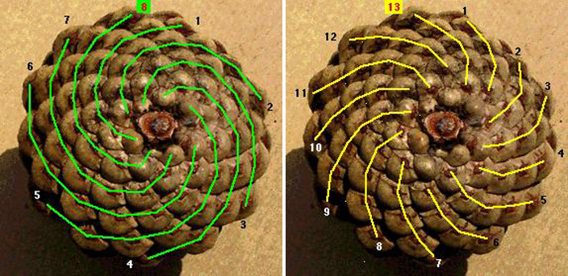

Look at a pinecone from the bottom. How many spirals go in the clockwise direction (green lines)? How many spirals go in the counter-clockwise direction (yellow lines)? Wouldn't you expect that they would be the same? 

Image from the [MENSA for Kids](https://www.mensaforkids.org/teach/lesson-plans/fabulous-fibonacci/) that shows Fibonacci numbers in pinecone:

The number of spirals found on pinecones are almost always Fibonacci numbers, which are .

## Fibonacci Sequence

$0, 1, 1, 2, 3, 5, 8, 13, 21, 34, 55, 89, 144, \ldots$

## Why Fibonacci numbers appear? 

