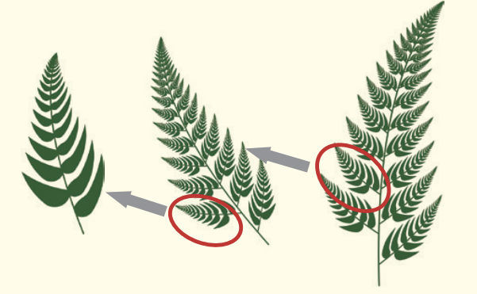

A fractal is a structure that possessed the property of \textbf{self-similarity}. Specifically, it refers to a structure where the exact same shape repeatedly appears when the entire figure is broken down into several smaller parts.

While fractal patterns and shapes appear complex at first glance, they are actually the result of repeating simple rules and operations.

While fractals are a concept rooted in geometry, the fractal approach can also be applied to analyse various phenomena, such as stock prices, currency fluctuations, and social structures.

Many examples of fractals can also be observed in the natural world. These include a wide variety of examples, such as \textbf{snowflakes}, \textbf{seashells} (like turbn shells and nautiluses), the shapes of cumulonimbus clouds, and the circulatory system in the human body (including the heart, blood vessels, and lymphatic vessels).

