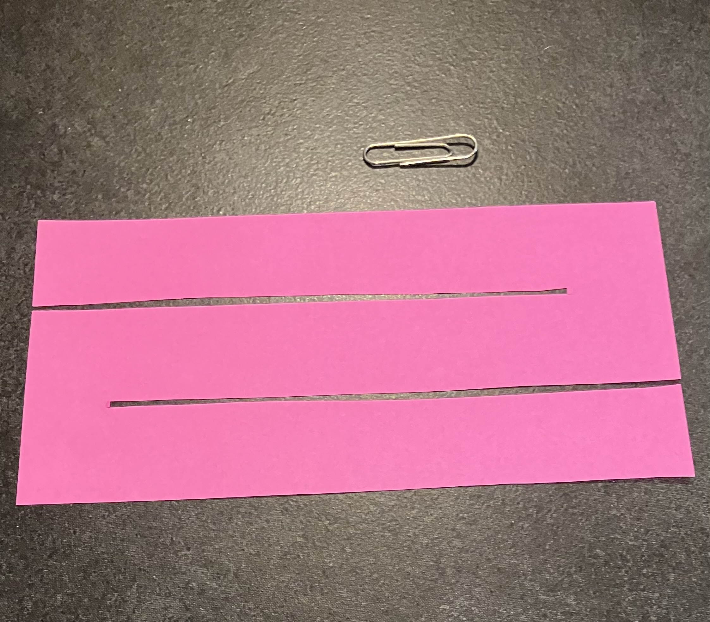
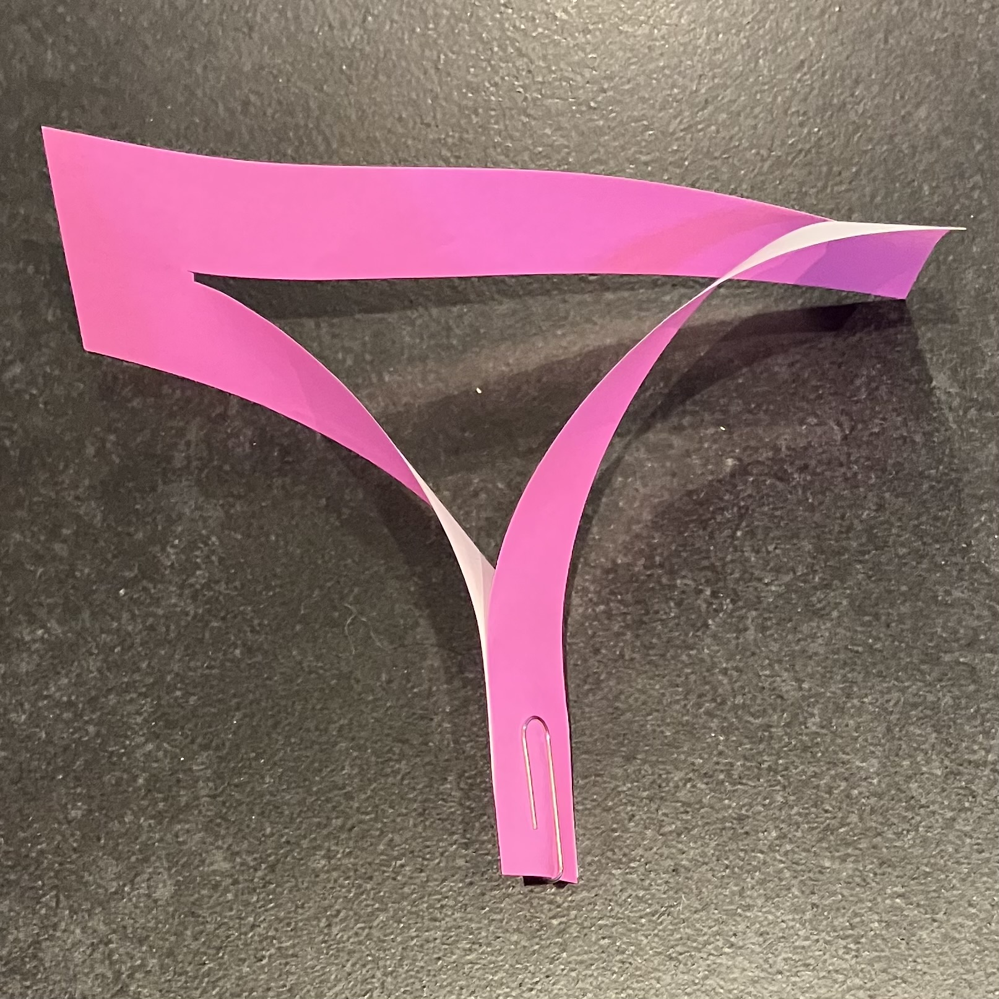
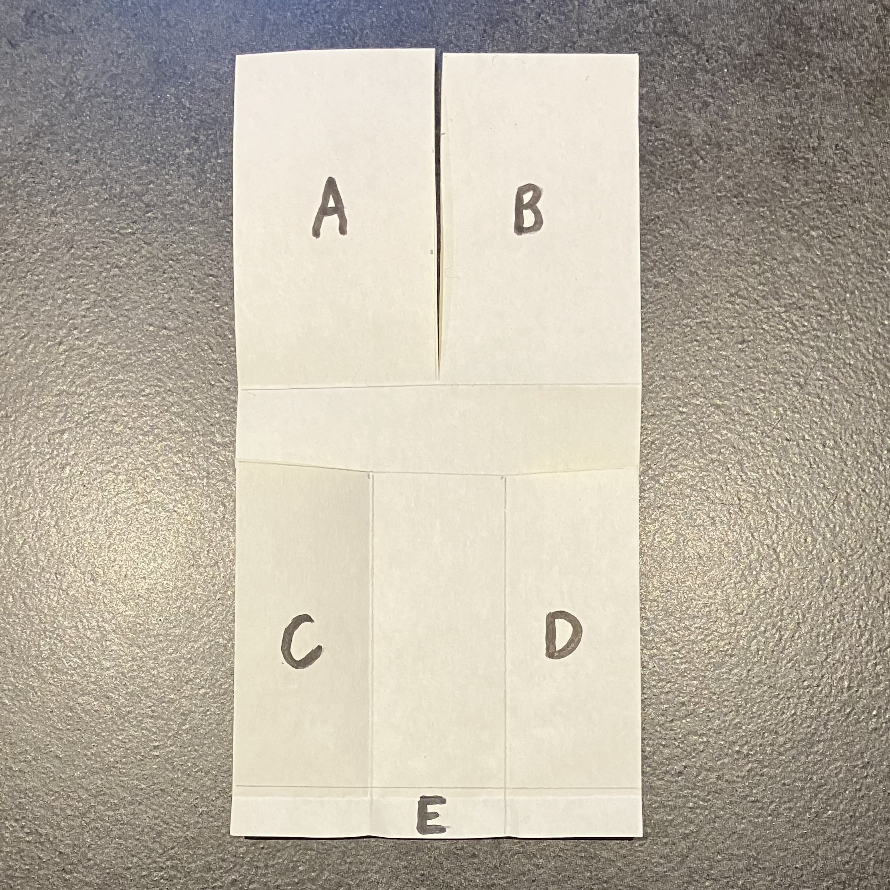
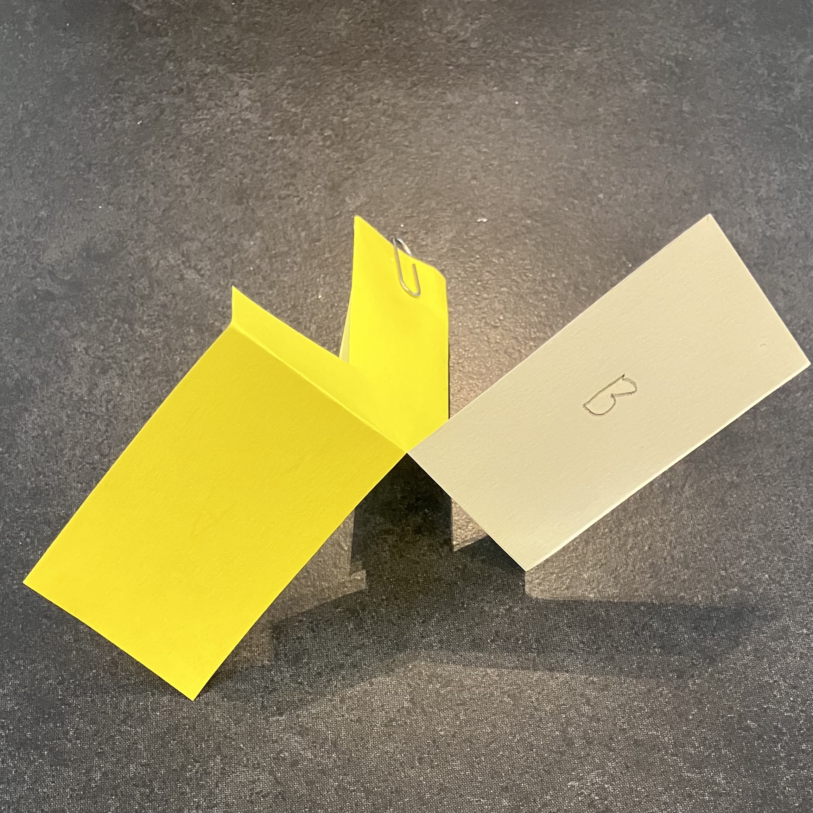

The seeds from lime, maple, and other trees spin and fly a little bit like helicopters -- helping the seeds travel further, giving the new plant the best chances of enough light, space and nutrients to grow. Precut origami paper and paper-clips are available at the Dundee Botanic Garden reception during Maths Week Scotland for you to make your own.

*Design 1 (pink photos):* Fasten the ends together with a paper clip into a kind of triangle shape.

{height="1.15in" fig-pos="H"}
{height="1.15in" fig-pos="H"}
{height="1.15in" fig-pos="H"}
{height="1.15in" fig-pos="H"}

*Design 2 (yellow photos):*

1. Fold wing A and wing B down in opposite directions.
2. Fold up flap E at the bottom of the origami.
3. Fold flaps C and flap D inwards, onto the centre area.
4. Paper clip the bottom of the helicopter (at E, C and D).

Now find a spinning seed in the garden. Throw this and your own paper spinner high, and watch let them spin down. Is is the same, or different?