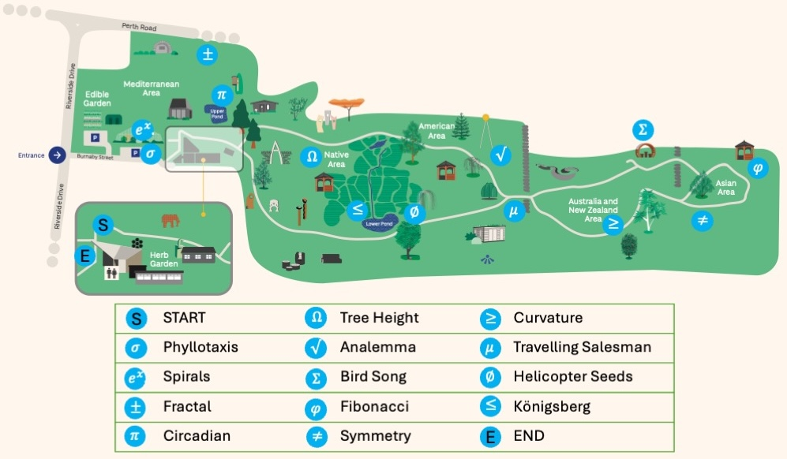

Welcome! While exploring the [Botanic Garden](https://www.dundee.ac.uk/botanic), you can use
a smart phone to scan QR codes that will take you to the appropriate  [Maths Trail](https://www.dundee.ac.uk/events/maths-trail-dundee-botanic-garden)
webpage. This trail was created for the [Maths Week Scotland](https://mathsweek.scot) 2026 programme of events.

There are 15 QR codes on blue posts scattered around the garden, including the start
(marked "S" on the map above, which points to this page on the website) and end (marked "E").
The remainder can be visited in any order, and are labelled with various mathematical symbols.
