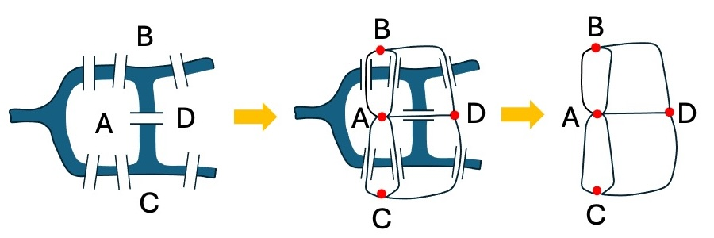

In the 1700s the city of Königsberg was built around two branches of a river, with an island sitting where they met. Seven bridges connected the four separate pieces of land -- and the people of the city had a favourite Sunday puzzle: could you walk through the city and cross every one of the seven bridges exactly once?

{width="6in"}

Nobody could ever do it. Nobody could ever explain *why*, either -- until a mathematician called Leonhard Euler looked at the problem in 1736, and realised something surprising: it doesn't matter how big the islands are, how long the bridges are, or what order you visit things in. All that matters is *which* pieces of land are joined to *which*, and by how many bridges. That single idea -- throw away the shape and the distance, keep only the connections -- was the birth of an entire branch of mathematics: graph theory, and later, topology.

::: {.content-hidden when-format="pdf"}

## Find it in the gardens

In this region of the Botanic Gardens there is a stream with some bridges? How many bridges can you find? HOw does the topology of the gridges compare to Königsberg?

## Try it here

Tap (or click) a landmass on the map below to start your walk, then tap the bridges (numbered 1-7, matching the logs in the gardens) to cross them one at a time. Try to use all seven bridges exactly once.

::: {#fig-konigsberg .content-hidden when-format="pdf"}
```{=html}
<style>
  #konig-app, #konig-app * { box-sizing: border-box; }
  #konig-app {
    display: flex;
    flex-wrap: wrap;
    gap: 14px;
    align-items: flex-start;
    font-family: -apple-system, BlinkMacSystemFont, 'Segoe UI', Helvetica, Arial, sans-serif;
    max-width: 1040px;
    text-align: left;
  }
  #konig-app .sidebar {
    flex: 0 0 260px;
    min-width: 0;
  }
  #konig-app .canvas-wrap {
    flex: 1 1 400px;
    min-width: 0;
  }
  #konig-app h5 {
    margin: 0 0 8px 0;
    font-size: 14px;
  }
  #konig-app #konig-status {
    font-size: 13px;
    line-height: 1.55;
    margin-bottom: 12px;
  }
  #konig-app button#konig-reset {
    display: inline-block;
    padding: 7px 16px;
    font-size: 13px;
    border-radius: 4px;
    cursor: pointer;
    background: #2f7d4f;
    color: #fff;
    border: none;
    margin-bottom: 14px;
  }
  #konig-app button#konig-reset:active {
    background: #245e3d;
  }
  #konig-app label {
    display: block;
    font-size: 13px;
    line-height: 1.4;
    cursor: pointer;
  }
  #konig-app label input[type="checkbox"] {
    margin-right: 6px;
    vertical-align: middle;
  }
  #konig-app #konig-theory-panel {
    font-size: 12.5px;
    line-height: 1.55;
    margin-top: 10px;
    background: #f5f3ea;
    border: 1px solid #ddd6c0;
    border-radius: 6px;
    padding: 10px 12px;
  }
  #konig-app #konig-theory-panel[hidden] {
    display: none;
  }
  #konig-app #konig-theory-panel ul {
    margin: 6px 0;
    padding-left: 20px;
  }
  #konig-canvas {
    width: 100%;
    height: auto;
    display: block;
    border-radius: 6px;
    cursor: pointer;
    touch-action: none;
  }
  @media (max-width: 520px) {
    #konig-app { gap: 8px; }
    #konig-app .sidebar { flex-basis: 100%; order: 2; }
    #konig-app .canvas-wrap { flex-basis: 100%; order: 1; }
    #konig-app h5 { font-size: 12px; }
    #konig-app #konig-status { font-size: 12px; }
    #konig-app button#konig-reset { padding: 8px 16px; font-size: 13px; }
    #konig-app #konig-theory-panel { font-size: 11.5px; }
  }
</style>

<div id="konig-app">
  <div class="canvas-wrap">
    <canvas id="konig-canvas" width="640" height="600"></canvas>
  </div>
  <div class="sidebar">
    <h5>Walk across every bridge</h5>
    <div id="konig-status">Tap a landmass on the map to start your walk.</div>
    <button id="konig-reset" type="button">Reset walk</button>
    <label><input type="checkbox" id="konig-show-theory"> Show bridge counts (and why it's impossible)</label>
    <div id="konig-theory-panel" hidden>
      <p><strong>Turn it into a graph.</strong> Shrink each landmass down to a dot (mathematicians call it a <em>node</em>), and each bridge down to a line joining two dots (an <em>edge</em>). The exact size and shape stop mattering -- only <em>which dots are joined, and how many times</em>.</p>
      <p><strong>Count the bridges at each dot -- its <em>degree</em>:</strong></p>
      <ul>
        <li>North bank: <strong>3</strong></li>
        <li>South bank: <strong>3</strong></li>
        <li>Island: <strong>5</strong></li>
        <li>East side: <strong>3</strong></li>
      </ul>
      <p><strong>Euler's trick:</strong> every time your walk passes <em>through</em> a landmass (not starting or ending there), it uses up two of that landmass's bridges at once -- one to arrive, one to leave. So a landmass can only be a start or an end point if it has an <em>odd</em> number of bridges. A walk has exactly one start and one end, so <strong>at most 2 landmasses are allowed an odd degree</strong>.</p>
      <p>Königsberg has <strong>4</strong> landmasses with an odd degree -- two more than is ever allowed. That's not bad luck: it's a proof that no route can ever cross every bridge exactly once, no matter how cleverly you try.</p>
    </div>
  </div>
</div>

<script>
(function () {
  "use strict";
  if (window.SHOW_JS_APPS === false) return;

  // -------------------------------------------------------------------
  // The Seven Bridges of Königsberg, as an interactive walk, ported 1:1
  // from the Python/Shinylive version (konigsberg_py.qmd) to plain
  // JavaScript + <canvas> -- same node/bridge layout, same click and
  // "nearest crossable bridge" logic, same degree counts. Runs entirely
  // in the browser, no Python runtime required.
  //
  // Four landmasses (the graph's "nodes"), joined by seven bridges (the
  // graph's "edges"): two bridges between the north bank and the
  // island, two between the south bank and the island, and one each
  // between north-east, south-east, and island-east. That's the
  // historically accurate bridge layout -- it's the reason every
  // landmass ends up with an ODD number of bridges (3, 3, 5, 3), which
  // is exactly why Euler could prove no walk can ever cross all seven
  // exactly once (see the "theory" panel).
  // -------------------------------------------------------------------

  var root = document.getElementById("konig-app");
  if (!root) return;

  // Data-space axes, matching the original matplotlib xlim/ylim.
  var X_MIN = -2.5, X_MAX = 2.5, Y_MIN = -2.3, Y_MAX = 2.3;

  var NODES = {
    north: [0.0, 1.55],
    south: [0.0, -1.55],
    island: [-1.55, 0.0],
    east: [1.65, 0.0]
  };
  var NODE_ORDER = ["north", "south", "island", "east"];
  var NODE_LABELS = {
    north: "North bank",
    south: "South bank",
    island: "Island",
    east: "East side"
  };
  var NODE_RADIUS = 0.42;

  var BRIDGE_ENDPOINTS = [
    ["north", "island"],
    ["north", "island"],
    ["south", "island"],
    ["south", "island"],
    ["north", "east"],
    ["south", "east"],
    ["island", "east"]
  ];

  function buildBridges() {
    var groups = {};
    BRIDGE_ENDPOINTS.forEach(function (pair, i) {
      var key = [pair[0], pair[1]].slice().sort().join("|");
      if (!groups[key]) groups[key] = [];
      groups[key].push(i);
    });
    var offsetStep = 0.32;
    var bridges = [];
    BRIDGE_ENDPOINTS.forEach(function (pair, i) {
      var a = pair[0], b = pair[1];
      var key = [a, b].slice().sort().join("|");
      var group = groups[key];
      var idxInGroup = group.indexOf(i);
      var n = group.length;
      var x1 = NODES[a][0], y1 = NODES[a][1];
      var x2 = NODES[b][0], y2 = NODES[b][1];
      var dx = x2 - x1, dy = y2 - y1;
      var length = Math.hypot(dx, dy);
      var ux = dx / length, uy = dy / length;
      var perpX = -uy, perpY = ux;
      var amount = (idxInGroup - (n - 1) / 2.0) * offsetStep;
      var ox = perpX * amount, oy = perpY * amount;
      var p1 = [x1 + ox, y1 + oy];
      var p2 = [x2 + ox, y2 + oy];
      var mid = [(p1[0] + p2[0]) / 2.0, (p1[1] + p2[1]) / 2.0];
      bridges.push({ id: i, a: a, b: b, p1: p1, p2: p2, mid: mid });
    });
    return bridges;
  }

  var BRIDGES = buildBridges();

  var NODE_DEGREE = {};
  NODE_ORDER.forEach(function (k) { NODE_DEGREE[k] = 0; });
  BRIDGES.forEach(function (br) {
    NODE_DEGREE[br.a]++;
    NODE_DEGREE[br.b]++;
  });

  function pointSegDist(px, py, x1, y1, x2, y2) {
    var dx = x2 - x1, dy = y2 - y1;
    if (dx === 0 && dy === 0) return Math.hypot(px - x1, py - y1);
    var t = ((px - x1) * dx + (py - y1) * dy) / (dx * dx + dy * dy);
    t = Math.max(0, Math.min(1, t));
    var cx = x1 + t * dx, cy = y1 + t * dy;
    return Math.hypot(px - cx, py - cy);
  }

  function nearestNode(cx, cy, tol) {
    tol = tol === undefined ? 0.55 : tol;
    var best = null, bestD = tol;
    NODE_ORDER.forEach(function (key) {
      var x = NODES[key][0], y = NODES[key][1];
      var d = Math.hypot(cx - x, cy - y);
      if (d < bestD) { best = key; bestD = d; }
    });
    return best;
  }

  function nearestCrossableBridge(pos, crossedSet, cx, cy, tol) {
    tol = tol === undefined ? 0.22 : tol;
    var best = null, bestD = tol;
    BRIDGES.forEach(function (br) {
      if (crossedSet.has(br.id)) return;
      if (br.a !== pos && br.b !== pos) return;
      var d = pointSegDist(cx, cy, br.p1[0], br.p1[1], br.p2[0], br.p2[1]);
      if (d < bestD) { best = br.id; bestD = d; }
    });
    return best;
  }

  function makeTransform(W, H) {
    var scale = Math.min(W / (X_MAX - X_MIN), H / (Y_MAX - Y_MIN));
    var offX = (W - (X_MAX - X_MIN) * scale) / 2;
    var offY = (H - (Y_MAX - Y_MIN) * scale) / 2;
    return {
      sx: function (x) { return offX + (x - X_MIN) * scale; },
      sy: function (y) { return H - offY - (y - Y_MIN) * scale; },
      ix: function (px) { return X_MIN + (px - offX) / scale; },
      iy: function (py) { return Y_MIN + (H - offY - py) / scale; },
      scale: scale
    };
  }

  function init() {
    var canvas = root.querySelector("#konig-canvas");
    var ctx = canvas.getContext("2d");
    var statusDiv = root.querySelector("#konig-status");
    var resetBtn = root.querySelector("#konig-reset");
    var theoryCheck = root.querySelector("#konig-show-theory");
    var theoryPanel = root.querySelector("#konig-theory-panel");

    var state = { position: null, crossed: new Set(), walkLog: [] };

    function isStuck() {
      if (state.position === null) return false;
      if (state.crossed.size >= BRIDGES.length) return false;
      for (var i = 0; i < BRIDGES.length; i++) {
        var br = BRIDGES[i];
        if (state.crossed.has(br.id)) continue;
        if (br.a === state.position || br.b === state.position) return false;
      }
      return true;
    }

    function drawCenteredLines(lines, cx, cy, fontPx, color, weight) {
      ctx.fillStyle = color;
      ctx.textAlign = "center";
      ctx.textBaseline = "middle";
      ctx.font = (weight || "bold") + " " + fontPx + "px -apple-system, BlinkMacSystemFont, 'Segoe UI', Helvetica, Arial, sans-serif";
      var lineHeight = fontPx * 1.2;
      var totalHeight = lineHeight * (lines.length - 1);
      var startY = cy - totalHeight / 2;
      lines.forEach(function (line, i) {
        ctx.fillText(line, cx, startY + i * lineHeight);
      });
    }

    function drawMap() {
      var W = canvas.width, H = canvas.height;
      var tr = makeTransform(W, H);
      var showTheory = theoryCheck.checked;

      ctx.clearRect(0, 0, W, H);

      // Water background.
      ctx.fillStyle = "#bfe3f0";
      ctx.fillRect(tr.sx(X_MIN), tr.sy(Y_MAX), (X_MAX - X_MIN) * tr.scale, (Y_MAX - Y_MIN) * tr.scale);

      // Bridges.
      BRIDGES.forEach(function (br) {
        var used = state.crossed.has(br.id);
        ctx.strokeStyle = used ? "#8b5a2b" : "#cdb894";
        ctx.lineWidth = used ? 6.5 : 4.5;
        ctx.lineCap = "round";
        ctx.beginPath();
        ctx.moveTo(tr.sx(br.p1[0]), tr.sy(br.p1[1]));
        ctx.lineTo(tr.sx(br.p2[0]), tr.sy(br.p2[1]));
        ctx.stroke();

        var badgeFace = used ? "#8b5a2b" : "#ffffff";
        var badgeText = used ? "#ffffff" : "#8b5a2b";
        ctx.beginPath();
        ctx.fillStyle = badgeFace;
        ctx.strokeStyle = "#6b4520";
        ctx.lineWidth = 1.4;
        ctx.arc(tr.sx(br.mid[0]), tr.sy(br.mid[1]), 15, 0, 2 * Math.PI);
        ctx.fill();
        ctx.stroke();

        ctx.fillStyle = badgeText;
        ctx.textAlign = "center";
        ctx.textBaseline = "middle";
        ctx.font = "bold 14px -apple-system, BlinkMacSystemFont, 'Segoe UI', Helvetica, Arial, sans-serif";
        ctx.fillText(String(br.id + 1), tr.sx(br.mid[0]), tr.sy(br.mid[1]) + 1);
      });

      // Landmasses.
      NODE_ORDER.forEach(function (key) {
        var here = state.position === key;
        var x = NODES[key][0], y = NODES[key][1];
        ctx.beginPath();
        ctx.fillStyle = here ? "#ffd93d" : "#9fd17a";
        ctx.strokeStyle = here ? "#c9960a" : "#4f7a3a";
        ctx.lineWidth = here ? 3.2 : 2.0;
        ctx.arc(tr.sx(x), tr.sy(y), NODE_RADIUS * tr.scale, 0, 2 * Math.PI);
        ctx.fill();
        ctx.stroke();

        var lines;
        var fontPx;
        if (showTheory) {
          var deg = NODE_DEGREE[key];
          var parity = deg % 2 ? "odd" : "even";
          lines = [NODE_LABELS[key], deg + " bridges", "(" + parity + ")"];
          fontPx = 13;
        } else {
          lines = [NODE_LABELS[key]];
          fontPx = 16;
        }
        drawCenteredLines(lines, tr.sx(x), tr.sy(y), fontPx, "#1c3d0e", "bold");

        if (here) {
          ctx.fillStyle = "#8a6d00";
          ctx.font = "bold 13px -apple-system, BlinkMacSystemFont, 'Segoe UI', Helvetica, Arial, sans-serif";
          ctx.textAlign = "center";
          ctx.textBaseline = "top";
          ctx.fillText("you are here", tr.sx(x), tr.sy(y - NODE_RADIUS) + 6);
        }
      });
    }

    function updateStatus() {
      var lines = [];
      if (state.position === null) {
        lines.push("<strong>Tap a landmass</strong> on the map to start your walk.");
      } else {
        var path = state.walkLog.map(function (k) { return NODE_LABELS[k]; }).join(" → ");
        var n = state.crossed.size;
        lines.push("<strong>Bridges crossed:</strong> " + n + " of 7");
        lines.push("<strong>Your route so far:</strong> " + path);
        if (isStuck()) {
          lines.push(
            "<strong>Stuck!</strong> Every bridge from " + NODE_LABELS[state.position] +
            " has already been used, and only " + n + " of the 7 bridges are crossed. " +
            "Tap <strong>Reset walk</strong> and try a different route — or tick the box " +
            "below to see why this always happens."
          );
        } else if (n === BRIDGES.length) {
          lines.push(
            "You crossed every bridge exactly once! If you really didn't repeat a bridge, " +
            "double-check your route — this exact puzzle is famously impossible, so it's " +
            "worth being sure."
          );
        }
      }
      statusDiv.innerHTML = lines.join("<br><br>");
    }

    function render() {
      drawMap();
      updateStatus();
    }

    function handleTap(clientX, clientY) {
      var rect = canvas.getBoundingClientRect();
      if (rect.width === 0 || rect.height === 0) return;
      var xCss = clientX - rect.left;
      var yCss = clientY - rect.top;
      var xPx = xCss * (canvas.width / rect.width);
      var yPx = yCss * (canvas.height / rect.height);
      var tr = makeTransform(canvas.width, canvas.height);
      var dataX = tr.ix(xPx);
      var dataY = tr.iy(yPx);

      if (state.position === null) {
        var node = nearestNode(dataX, dataY);
        if (node !== null) {
          state.position = node;
          state.walkLog = [node];
          render();
        }
        return;
      }

      var brId = nearestCrossableBridge(state.position, state.crossed, dataX, dataY);
      if (brId === null) return;
      var br = BRIDGES[brId];
      var other = br.a === state.position ? br.b : br.a;
      state.crossed.add(brId);
      state.position = other;
      state.walkLog.push(other);
      render();
    }

    // Pointer Events cover mouse, touch and pen with a single handler,
    // so taps on a phone/tablet and clicks with a mouse both work.
    canvas.addEventListener("pointerdown", function (evt) {
      evt.preventDefault();
      handleTap(evt.clientX, evt.clientY);
    });

    resetBtn.addEventListener("click", function () {
      state.position = null;
      state.crossed = new Set();
      state.walkLog = [];
      render();
    });

    theoryCheck.addEventListener("change", function () {
      theoryPanel.hidden = !theoryCheck.checked;
      render();
    });

    render();
  }

  init();
})();
</script>
```
:::

## Turning it into a graph

Shrink each landmass down to a single dot -- mathematicians call it a *node* (or *vertex*) -- and shrink each bridge down to a line joining two dots -- an *edge*. That's it: you've just drawn the same map above as a graph. The exact size and shape don't matter any more, only which dots are joined, and how many times.

## Why is it impossible?

Count how many bridges touch each landmass -- its *degree*:

- North bank: **3**
- South bank: **3**
- Island: **5**
- East side: **3**

Here's Euler's trick. Every time your walk passes *through* a landmass in the middle of your route (not starting or ending there), you use up two of its bridges at once: one to arrive, one to leave. So a landmass can only be left with a single, unpaired bridge -- which makes it usable only as a *start* or an *end* point -- if it has an **odd** number of bridges. A walk has exactly one start and one end, so at most **two** landmasses in the whole map are allowed to have an odd degree.

Königsberg has **four** landmasses with an odd degree -- two more than is ever allowed. That's not bad luck, and it's not that nobody was clever enough: it's a mathematical proof that no route can *ever* cross every bridge exactly once, no matter how hard you try or how many times you attempt it.

This same idea -- turning a real problem into dots and connections, then reasoning about the connections alone -- now underpins everything from delivery-route planning to computer chip design to mapping how a disease spreads through a network of people. It all traces back to seven bridges over a river in Königsberg, and one mathematician who realised the shape never mattered at all.

:::
