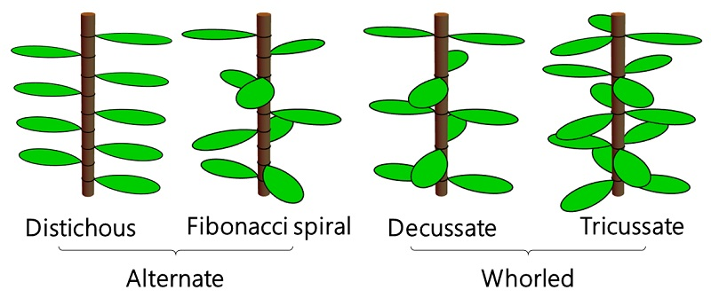

Plants space their leaves using specific divergence angles (the angular degree separation between successive leaves on a stem), which is known as phyllotaxis. Phyllotaxis has common characteristic across plant species, which are mathematically characterised in a small number of phyllotactic patterns.

Which of the following leaf arrangement pattern do you find in this plant?

## Distichous ($180^\circ$)
Leaves alternate on opposite sides of the stem in a single flat plane.

## Fibonacci Spiral ($137.5^\circ$)
Leaves wind in a tight spiral using the golden angle, maximising space and light efficiency.

## Decussate ($90^\circ$)
Successive pairs of leaves sit at right angles to each other.

## Tricussate ($60^\circ$)
Whorls feature three leaves per node, rotated evenly around the stem.

Image from the [University of Tokyo](https://www.u-tokyo.ac.jp/focus/en/press/z0508_00047.html) that shows the classification patterns:

