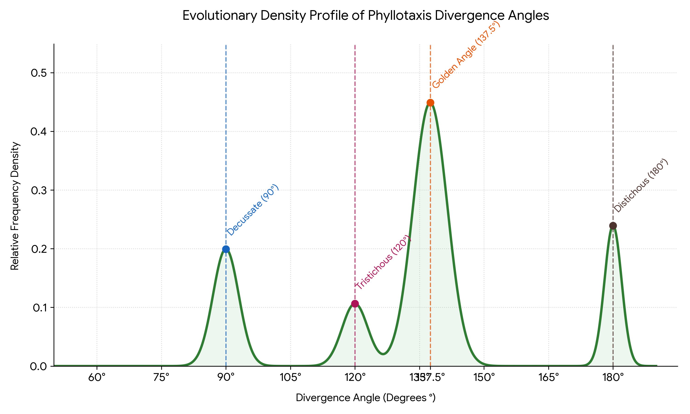

Plant species optimize their solar capture and space packing using specific evolutionary patterns. While the
golden angle ($137.5^\circ$) is famous, species also commonly exhibit alternate patterns like distichous ($180^\circ$),
decussate ($90^\circ$), or tristichous ($120^\circ$) arrangements. In this hands-on investigation, your team will act as field
data scientists to harvest real-world biological samples, aggregate multi-species raw tallies, and build a
categorical frequency distribution to determine which divergence architecture dominates the local ecosystem.

## Requirements and Setup
TBC

## Data Harvest Protocol
Ideally interactive setup so that visitor can enter their collection data to the website

## Field Data Log
TBC

## Data Science and Statistical Pipeline
TBC

## Critical Analytics Lab Prompts
TBC

