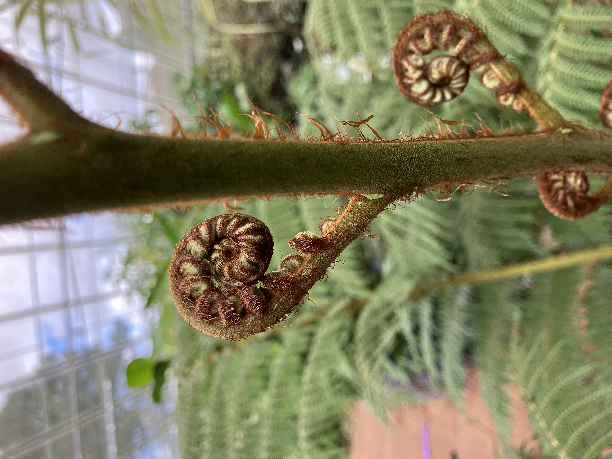
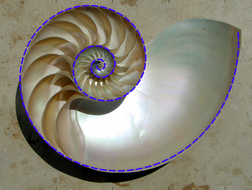
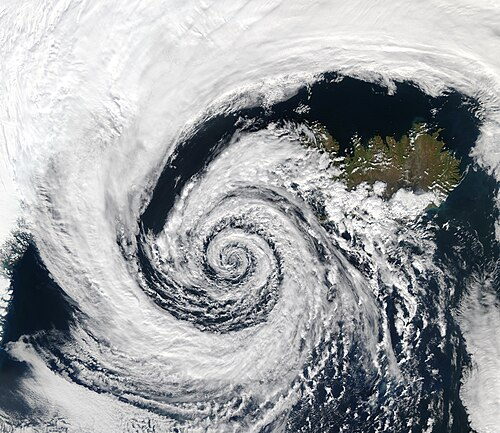
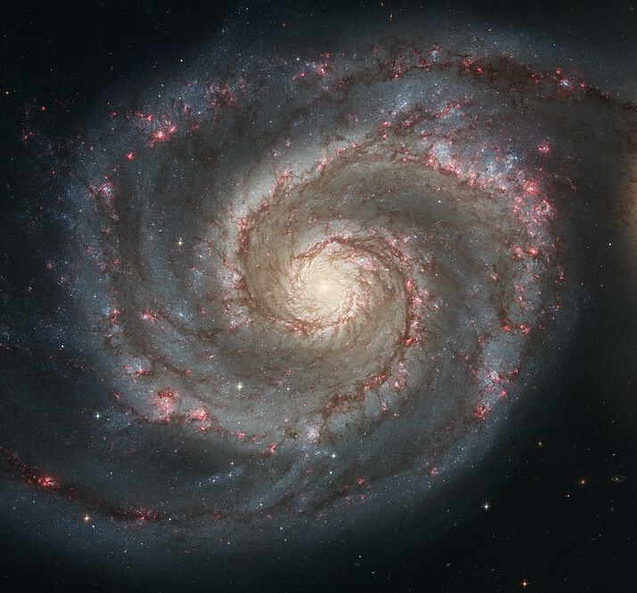
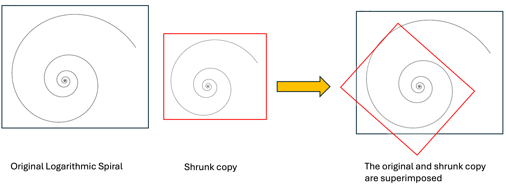

When a young fern sprout (known as a fiddlehead) is tightly coiled, it forms a logarithmic spiral.

{width="2.6in" fig-pos="H"}

Logarithmic spiral spiral appears often in nature such as:

* nautilus shell,
* hurricane,
* spiral galaxies.  

{width="2.6in" fig-pos="H"}
{width="2.3in" fig-pos="H"}
{width="2.8in" fig-pos="H"}

One of characteristic properties of logarithmic spiral is complete self-similarity. If you shrink or enlarge it by any arbitrary scale factor, not just a specific fixed ratio, and rotate it by an appropriat angle, it matches the original spiral. 

{width="6in" fig-pos="H"}
