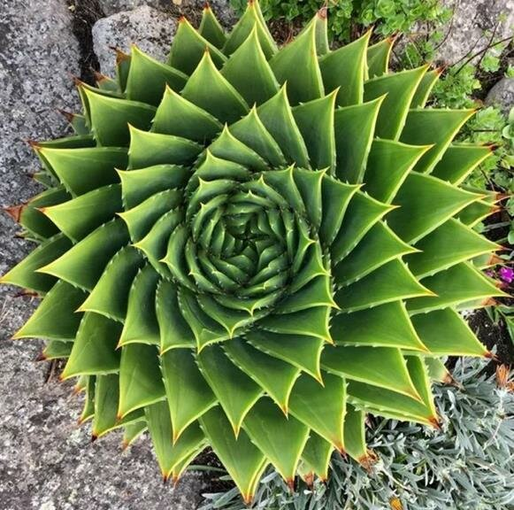

Logarithmic spirals in plants are a striking example of geometry in nature, where botanical structures grow according to the Golden Ratio and the Fibonacci sequence.

## Spiralling Succulents
Many varieties of succulents arrange their leaves outward from a central point along an expanding logarithmic trajectry to ensure uniform access to sunlight and water collection.

mage from the [Fractal Dimensions in Circular and Spiral Phenomena](https://www.techrxiv.org/doi/full/10.36227/techrxiv.21766706.v1) that shows logarithmic spiral in Aloe Polyphylla:

## Sunflower Seed Heads
The packing of seeds in a sunflower head features two sets of overlapping logarithmic spirals - one running clockwise and the other anticlockwise - maximising the number of seeds that can fit into the centre.

## Pinecone Scale Arrangements
Pinecones exhibit steep logarithmic spirals formed by their scaling bracts, tightly safeguarding the seeds inside.

