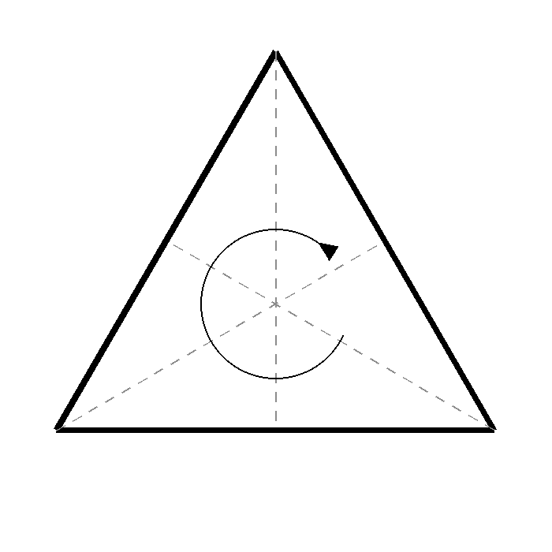
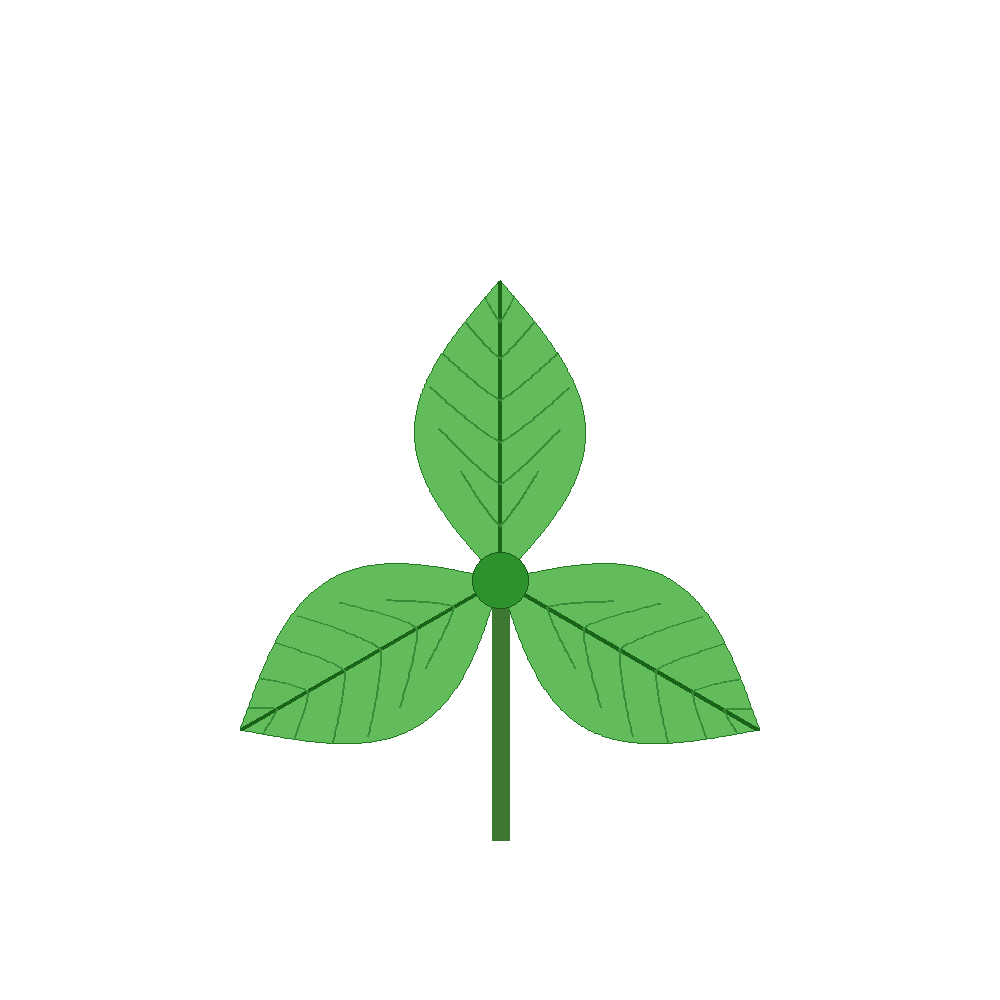

Plant leaves display a remarkable variety of symmetrical arrangements. Many leaves exhibit bilateral symmetry, where a single line divides the leaf into two mirror-image halves. Other plant structures show radial symmetry, in which features are arranged around a central point. In some flowers and leaf rosettes, one observes higher-order rotational symmetries, where a rotation through a specific angle leaves the pattern unchanged. These recurring arrangements are not merely aesthetic; they often reflect underlying developmental processes that help plants maximize light capture, structural stability, and make efficient use of space.

::: {#fig-curved layout-ncol=2}


{width="1.0in"}

{width="1.0in"}

:::


Symmetry occupies a central place in mathematics because it provides a way to describe order, regularity, and invariance. Mathematicians study the transformations that leave an object unchanged, such as reflections, rotations, and translations. By focusing on these invariant properties, mathematicians are able to classify shapes and patterns, compare biological structures, and uncover deeper relationships between seemingly different forms.  The mathematical study of symmetry naturally leads to group theory, one of the most important branches of modern algebra. 


::: {.content-hidden when-format="pdf"}

## Group Theory

A group is a collection of transformations together with rules for combining them. For a trifold symmetric pattern, for instance, the set of rotations through 0°, 120°, and 240° forms a group because combining any two of these rotations produces another rotation from the same set. Group theory provides a powerful language for describing symmetry not only in plants, but also in crystals, molecules, physics, and art. What begins as the observation of a simple repeating pattern in nature thus develops into a rich mathematical framework that helps explain structure and order across many scientific disciplines.


## Try it yourself

The triangle's three rotations described above -- 0°, 120°, and 240° -- are just one small example of a much bigger idea. Below, pick two turns and combine them, and watch where the shape lands: however you pick your two turns, you always end up back on one of the same allowed positions. Switch the shape to see the same pattern hold for a square, a pentagon, and a hexagon too.

::: {#fig-symmetry-group .content-hidden when-format="pdf"}
```{=html}
<style>
  #sym-app, #sym-app * { box-sizing: border-box; }
  #sym-app {
    display: flex;
    flex-wrap: wrap;
    gap: 16px;
    align-items: flex-start;
    font-family: -apple-system, BlinkMacSystemFont, 'Segoe UI', Helvetica, Arial, sans-serif;
    max-width: 1040px;
    text-align: left;
  }
  #sym-app .sym-canvas-wrap {
    flex: 0 0 300px;
    min-width: 0;
  }
  #sym-app .sym-sidebar {
    flex: 1 1 320px;
    min-width: 0;
  }
  #sym-canvas {
    width: 100%;
    height: auto;
    display: block;
    border-radius: 6px;
    background: #fbfaf5;
  }
  #sym-app h5 {
    margin: 0 0 8px 0;
    font-size: 14px;
  }
  #sym-app .sym-row-label {
    font-size: 12.5px;
    font-weight: 600;
    margin: 10px 0 4px 0;
  }
  #sym-app .sym-shape-row label {
    display: inline-block;
    font-size: 13px;
    margin-right: 12px;
    cursor: pointer;
  }
  #sym-app .sym-shape-row input {
    margin-right: 4px;
    vertical-align: middle;
  }
  #sym-app .sym-btn-row {
    display: flex;
    flex-wrap: wrap;
    gap: 6px;
    margin-bottom: 4px;
  }
  #sym-app button.sym-angle-btn {
    padding: 6px 12px;
    font-size: 13px;
    border-radius: 4px;
    cursor: pointer;
    background: #fff;
    color: #2f7d4f;
    border: 1.5px solid #2f7d4f;
  }
  #sym-app button.sym-angle-btn.active {
    background: #2f7d4f;
    color: #fff;
  }
  #sym-app button#sym-combine {
    display: inline-block;
    padding: 8px 18px;
    font-size: 13px;
    border-radius: 4px;
    cursor: pointer;
    background: #2f7d4f;
    color: #fff;
    border: none;
    margin: 12px 8px 4px 0;
  }
  #sym-app button#sym-combine:disabled {
    background: #b7cdbe;
    cursor: not-allowed;
  }
  #sym-app button#sym-combine:active:not(:disabled) {
    background: #245e3d;
  }
  #sym-app button#sym-reset {
    display: inline-block;
    padding: 8px 16px;
    font-size: 13px;
    border-radius: 4px;
    cursor: pointer;
    background: #fff;
    color: #555;
    border: 1.5px solid #bbb;
    margin: 12px 0 4px 0;
  }
  #sym-app #sym-result {
    font-size: 13px;
    line-height: 1.55;
    min-height: 40px;
    margin-top: 6px;
  }
  #sym-app .sym-ref-wrap {
    font-size: 12.5px;
    margin-top: 10px;
  }
  #sym-app #sym-ref-row {
    display: flex;
    flex-wrap: wrap;
    gap: 6px;
    margin-top: 4px;
  }
  #sym-app .sym-ref-chip {
    display: inline-block;
    padding: 3px 9px;
    font-size: 12.5px;
    border-radius: 12px;
    background: #eee;
    color: #555;
    border: 1px solid #ddd;
  }
  #sym-app .sym-ref-chip.hit {
    background: #f0a500;
    color: #fff;
    border-color: #d18f00;
    font-weight: 600;
  }
  #sym-app label.sym-theory-toggle {
    display: block;
    font-size: 13px;
    line-height: 1.4;
    cursor: pointer;
    margin-top: 14px;
  }
  #sym-app label.sym-theory-toggle input[type="checkbox"] {
    margin-right: 6px;
    vertical-align: middle;
  }
  #sym-app #sym-theory-panel {
    font-size: 12.5px;
    line-height: 1.55;
    margin-top: 10px;
    background: #f5f3ea;
    border: 1px solid #ddd6c0;
    border-radius: 6px;
    padding: 10px 12px;
  }
  #sym-app #sym-theory-panel[hidden] {
    display: none;
  }
  #sym-app #sym-theory-panel ul {
    margin: 6px 0;
    padding-left: 20px;
  }
  @media (max-width: 560px) {
    #sym-app { gap: 10px; }
    #sym-app .sym-canvas-wrap { flex-basis: 100%; max-width: 320px; margin: 0 auto; order: 1; }
    #sym-app .sym-sidebar { flex-basis: 100%; order: 2; }
    #sym-app h5 { font-size: 12px; }
    #sym-app #sym-result { font-size: 12px; }
    #sym-app #sym-theory-panel { font-size: 11.5px; }
  }
</style>

<div id="sym-app">
  <div class="sym-canvas-wrap">
    <canvas id="sym-canvas" width="320" height="320"></canvas>
  </div>
  <div class="sym-sidebar">
    <h5>Combine two turns</h5>

    <div class="sym-row-label">Shape</div>
    <div class="sym-shape-row">
      <label><input type="radio" name="sym-shape" value="3" checked> Triangle</label>
      <label><input type="radio" name="sym-shape" value="4"> Square</label>
      <label><input type="radio" name="sym-shape" value="5"> Pentagon</label>
      <label><input type="radio" name="sym-shape" value="6"> Hexagon</label>
    </div>

    <div class="sym-row-label">First turn</div>
    <div class="sym-btn-row" id="sym-first-buttons"></div>

    <div class="sym-row-label">Then turn by</div>
    <div class="sym-btn-row" id="sym-second-buttons"></div>

    <button id="sym-combine" type="button" disabled>Combine</button>
    <button id="sym-reset" type="button">Reset</button>

    <div id="sym-result"></div>

    <div class="sym-ref-wrap">
      Allowed turns for this shape:
      <div id="sym-ref-row"></div>
    </div>

    <label class="sym-theory-toggle"><input type="checkbox" id="sym-show-theory"> Show the formal rules (advanced)</label>
    <div id="sym-theory-panel" hidden>
      <strong>Why this is a "group":</strong>
      <ul>
        <li><strong>Closure</strong> -- combine any two turns from the set, and you always land on another turn from the same set. You never end up somewhere new.</li>
        <li><strong>Identity</strong> -- 0° is the "do nothing" turn. Combine it with anything and nothing changes.</li>
        <li><strong>Inverses</strong> -- every turn has a partner that undoes it. For the triangle, 120° and 240° cancel each other out back to 0°.</li>
        <li><strong>Associativity</strong> -- combining is just adding angles and wrapping around at 360°, and addition never cares how you group it: (120°+240°)+120° lands the same place as 120°+(240°+120°).</li>
      </ul>
    </div>
  </div>
</div>

<script>
(function () {
  "use strict";
  if (window.SHOW_JS_APPS === false) return;

  var root = document.getElementById("sym-app");
  if (!root) return;

  var canvas = root.querySelector("#sym-canvas");
  var ctx = canvas.getContext("2d");
  var shapeRadios = root.querySelectorAll('input[name="sym-shape"]');
  var firstWrap = root.querySelector("#sym-first-buttons");
  var secondWrap = root.querySelector("#sym-second-buttons");
  var combineBtn = root.querySelector("#sym-combine");
  var resetBtn = root.querySelector("#sym-reset");
  var resultDiv = root.querySelector("#sym-result");
  var refRow = root.querySelector("#sym-ref-row");
  var theoryCheck = root.querySelector("#sym-show-theory");
  var theoryPanel = root.querySelector("#sym-theory-panel");

  var n = 3;
  var selectedFirst = null;
  var selectedSecond = null;
  var displayAngle = 0;
  var animating = false;

  function allowedAngles() {
    var arr = [];
    for (var i = 0; i < n; i++) arr.push(Math.round(i * 360 / n));
    return arr;
  }

  function polygonPoints(cx, cy, r, sides, rotationDeg) {
    var pts = [];
    var rot = (rotationDeg - 90) * Math.PI / 180;
    for (var i = 0; i < sides; i++) {
      var a = rot + i * 2 * Math.PI / sides;
      pts.push([cx + r * Math.cos(a), cy + r * Math.sin(a)]);
    }
    return pts;
  }

  function draw() {
    var W = canvas.width, H = canvas.height;
    ctx.clearRect(0, 0, W, H);
    var cx = W / 2, cy = H / 2, r = Math.min(W, H) * 0.34;

    var ghost = polygonPoints(cx, cy, r, n, 0);
    ctx.beginPath();
    ghost.forEach(function (p, i) { if (i === 0) ctx.moveTo(p[0], p[1]); else ctx.lineTo(p[0], p[1]); });
    ctx.closePath();
    ctx.setLineDash([4, 4]);
    ctx.strokeStyle = "#c9c2a8";
    ctx.lineWidth = 1.5;
    ctx.stroke();
    ctx.setLineDash([]);

    var pts = polygonPoints(cx, cy, r, n, displayAngle);
    ctx.beginPath();
    pts.forEach(function (p, i) { if (i === 0) ctx.moveTo(p[0], p[1]); else ctx.lineTo(p[0], p[1]); });
    ctx.closePath();
    ctx.fillStyle = "rgba(47,125,79,0.18)";
    ctx.fill();
    ctx.strokeStyle = "#2f7d4f";
    ctx.lineWidth = 2.5;
    ctx.stroke();

    ctx.beginPath();
    ctx.arc(cx, cy, 2.5, 0, 2 * Math.PI);
    ctx.fillStyle = "#555";
    ctx.fill();

    var v0 = pts[0];
    ctx.beginPath();
    ctx.moveTo(cx, cy);
    ctx.lineTo(v0[0], v0[1]);
    ctx.strokeStyle = "#c0392b";
    ctx.lineWidth = 1.5;
    ctx.stroke();
    ctx.beginPath();
    ctx.arc(v0[0], v0[1], 6, 0, 2 * Math.PI);
    ctx.fillStyle = "#c0392b";
    ctx.fill();
    ctx.strokeStyle = "#fff";
    ctx.lineWidth = 1.5;
    ctx.stroke();
  }

  function buildAngleButtons() {
    [firstWrap, secondWrap].forEach(function (wrap, idx) {
      wrap.innerHTML = "";
      allowedAngles().forEach(function (deg) {
        var b = document.createElement("button");
        b.type = "button";
        b.className = "sym-angle-btn";
        b.textContent = deg + "°";
        b.addEventListener("click", function () {
          if (animating) return;
          Array.prototype.forEach.call(wrap.querySelectorAll("button"), function (x) { x.classList.remove("active"); });
          b.classList.add("active");
          if (idx === 0) selectedFirst = deg; else selectedSecond = deg;
          updateCombineEnabled();
        });
        wrap.appendChild(b);
      });
    });
  }

  function buildRefRow() {
    refRow.innerHTML = "";
    allowedAngles().forEach(function (deg) {
      var span = document.createElement("span");
      span.className = "sym-ref-chip";
      span.textContent = deg + "°";
      span.setAttribute("data-deg", String(deg));
      refRow.appendChild(span);
    });
  }

  function updateCombineEnabled() {
    combineBtn.disabled = (selectedFirst === null || selectedSecond === null || animating);
  }

  function setShape(newN) {
    n = newN;
    selectedFirst = null;
    selectedSecond = null;
    displayAngle = 0;
    resultDiv.textContent = "";
    buildAngleButtons();
    buildRefRow();
    updateCombineEnabled();
    draw();
  }

  function animateBy(deltaDeg, duration, done) {
    var start = displayAngle;
    var t0 = null;
    function step(ts) {
      if (t0 === null) t0 = ts;
      var p = Math.min(1, (ts - t0) / duration);
      var eased = p < 0.5 ? 2 * p * p : 1 - Math.pow(-2 * p + 2, 2) / 2;
      displayAngle = start + deltaDeg * eased;
      draw();
      if (p < 1) {
        requestAnimationFrame(step);
      } else {
        displayAngle = start + deltaDeg;
        draw();
        if (done) done();
      }
    }
    requestAnimationFrame(step);
  }

  function showResult(normalized) {
    var sum = selectedFirst + selectedSecond;
    var sumText = selectedFirst + "° + " + selectedSecond + "° = " + sum + "°";
    if (sum >= 360) {
      sumText += " ≡ " + normalized + "° (mod 360°)";
    }
    var chip = refRow.querySelector('.sym-ref-chip[data-deg="' + normalized + '"]');
    if (chip) chip.classList.add("hit");
    if (normalized === 0) {
      resultDiv.innerHTML = "<strong>" + sumText + "</strong><br>Back where you started — " + selectedFirst + "° and " + selectedSecond + "° undo each other.";
    } else {
      resultDiv.innerHTML = "<strong>" + sumText + "</strong><br>Still one of our " + n + " allowed turns — highlighted below.";
    }
  }

  combineBtn.addEventListener("click", function () {
    if (selectedFirst === null || selectedSecond === null || animating) return;
    animating = true;
    combineBtn.disabled = true;
    displayAngle = 0;
    draw();
    resultDiv.textContent = "";
    Array.prototype.forEach.call(refRow.querySelectorAll(".sym-ref-chip"), function (c) { c.classList.remove("hit"); });

    animateBy(selectedFirst, 700, function () {
      setTimeout(function () {
        animateBy(selectedSecond, 700, function () {
          var total = selectedFirst + selectedSecond;
          var normalized = ((total % 360) + 360) % 360;
          showResult(normalized);
          animating = false;
          updateCombineEnabled();
        });
      }, 300);
    });
  });

  resetBtn.addEventListener("click", function () {
    if (animating) return;
    displayAngle = 0;
    selectedFirst = null;
    selectedSecond = null;
    resultDiv.textContent = "";
    [firstWrap, secondWrap].forEach(function (wrap) {
      Array.prototype.forEach.call(wrap.querySelectorAll("button"), function (x) { x.classList.remove("active"); });
    });
    Array.prototype.forEach.call(refRow.querySelectorAll(".sym-ref-chip"), function (c) { c.classList.remove("hit"); });
    updateCombineEnabled();
    draw();
  });

  Array.prototype.forEach.call(shapeRadios, function (r) {
    r.addEventListener("change", function () {
      if (r.checked) setShape(parseInt(r.value, 10));
    });
  });

  theoryCheck.addEventListener("change", function () {
    theoryPanel.hidden = !theoryCheck.checked;
  });

  setShape(3);
})();
</script>
```

Try a pair that brings the shape all the way back around to 0° -- can you predict which one, before you press *Combine*? Then switch to the square or hexagon and see whether the same trick still works.
:::

:::
