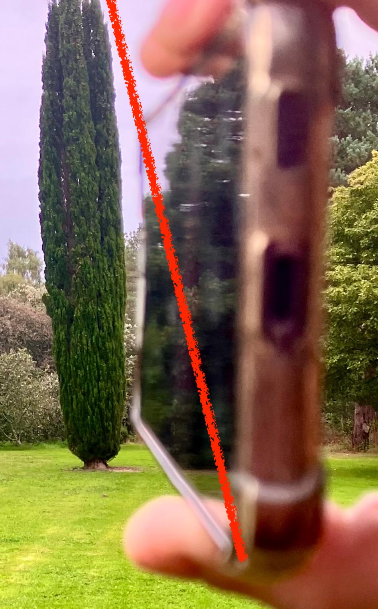

{width="6in"}


You need to measure the height of the large vertical tree in the open space beside you. You can do this standing on the ground with nothing but your own two feet and the phone that you are using.

## The idea

Everything below comes down to one right-angled triangle:

- your eye,
- the point on the tree that is at the same height as your eye,
- the top of the tree.

By measuring the walking distance to the base of the tree we can estimate the height using trigonometry.


::: {.content-hidden when-format="pdf"}

{width=2in}


## Try it yourself

1. Stand facing the tree, somewhere with room to walk backwards.
2. Hold your phone flat, in landscape orientation (see photo).
3. Sight across the phone's diagonal (see image above) and imagine a line extending towards the top of the tree.
4. Stop looking at your phone and adjust your position by walking forwards or backwards. Repeat steps 1-4 until the treetop lines up along the diagonal line.
5. Now count the number of paces you needed to get to the base of the tree.
6. Enter your pace count, your own pace length, and your eye height into the calculator below.
7. Hit **Reveal the true height!** and see how close you got.

::: {#fig-tree-height .content-hidden when-format="pdf"}
```{=html}
<style>
  #tree-app, #tree-app * { box-sizing: border-box; }
  #tree-app {
    display: flex;
    flex-wrap: wrap;
    gap: 14px;
    align-items: flex-start;
    font-family: -apple-system, BlinkMacSystemFont, 'Segoe UI', Helvetica, Arial, sans-serif;
    max-width: 1040px;
    text-align: left;
  }
  #tree-app h5,
  #tree-app label,
  #tree-app #tree-summary {
    text-align: left;
  }
  #tree-app .tree-sidebar {
    flex: 0 0 240px;
  }
  #tree-app .canvas-wrap {
    flex: 1 1 400px;
    min-width: 0;
  }
  #tree-app h5 {
    margin: 0 0 8px 0;
    font-size: 14px;
  }
  #tree-app label {
    display: block;
    font-size: 13px;
    margin: 10px 0 4px 0;
    line-height: 1.3;
  }
  #tree-app select,
  #tree-app input[type="range"] {
    width: 100%;
  }
  #tree-app select {
    font-size: 13px;
    padding: 3px;
  }
  #tree-app .hint {
    font-size: 11px;
    color: #666666;
    margin: 3px 0 0 0;
    line-height: 1.3;
  }
  #tree-app hr {
    margin: 14px 0;
    border: none;
    border-top: 1px solid #ddd;
  }
  #tree-app .btn-row {
    display: flex;
    flex-wrap: wrap;
    gap: 6px;
    margin-top: 10px;
  }
  #tree-app button {
    padding: 6px 14px;
    font-size: 13px;
    border-radius: 4px;
    cursor: pointer;
  }
  #tree-reveal {
    background: #2f6b3a;
    color: #fff;
    border: none;
  }
  #tree-reset {
    background: #eee;
    color: #333;
    border: 1px solid #ccc;
  }
  #tree-summary {
    font-size: 13px;
    line-height: 1.55;
  }
  #tree-canvas {
    width: 100%;
    height: auto;
    display: block;
    border-radius: 6px;
    background: #eaf4fb;
  }
  @media (max-width: 520px) {
    #tree-app { gap: 8px; }
    #tree-app .tree-sidebar { flex-basis: 100%; }
    #tree-app .canvas-wrap { flex-basis: 100%; }
    #tree-app h5 { font-size: 12px; }
    #tree-app label { font-size: 11px; margin: 8px 0 3px 0; }
    #tree-app button { padding: 5px 8px; font-size: 11px; }
    #tree-summary { font-size: 11px; line-height: 1.45; }
    #tree-app hr { margin: 10px 0; }
  }
</style>

<div id="tree-app">
  <div class="tree-sidebar">
    <h5>1. Your phone</h5>
    <label for="tree-phone-preset">Pick roughly your phone's shape</label>
    <select id="tree-phone-preset">
      <option value="0">Compact phone (~14.0 x 6.7 cm)</option>
      <option value="1" selected>Standard phone (~14.7 x 7.1 cm)</option>
      <option value="2">Large phone (~16.0 x 7.7 cm)</option>
      <option value="3">Square card -- the classic 45&deg; trick (10 x 10 cm)</option>
    </select>
    <label for="tree-width">Width, landscape (cm): <strong id="tree-width-val">14.7</strong></label>
    <input id="tree-width" type="range" min="1" max="20" step="0.1" value="14.7">
    <label for="tree-height">Height, landscape (cm): <strong id="tree-height-val">7.1</strong></label>
    <input id="tree-height" type="range" min="1" max="20" step="0.1" value="7.1">
    <hr>
    <h5>2. You</h5>
    <label for="tree-eye">Your eye height (cm): <strong id="tree-eye-val">150</strong></label>
    <input id="tree-eye" type="range" min="50" max="220" step="1" value="150">
    <p class="hint">Measure straight up from the ground to the corner of your eye -- or roughly your height minus about 10 cm.</p>
    <label for="tree-pacelen">Your pace length (cm): <strong id="tree-pacelen-val">50</strong></label>
    <input id="tree-pacelen" type="range" min="20" max="150" step="1" value="50">
    <p class="hint">Walk 10 natural paces, measure the total distance, and divide by 10 to find your own pace length.</p>
    <hr>
    <h5>3. Your result</h5>
    <label for="tree-paces">Paces walked to line up with the tree: <strong id="tree-paces-val">40</strong></label>
    <input id="tree-paces" type="range" min="0" max="150" step="1" value="40">
    <div id="tree-summary"></div>
    <div class="btn-row">
      <button id="tree-reveal" type="button">Reveal the true height!</button>
      <button id="tree-reset" type="button">Try again</button>
    </div>
  </div>
  <div class="canvas-wrap">
    <canvas id="tree-canvas" width="640" height="560"></canvas>
  </div>
</div>

<script>
(function () {
  "use strict";
  if (window.SHOW_JS_APPS === false) return;

  // -------------------------------------------------------------------
  // Plain JavaScript port of the Shinylive/matplotlib tree-height demo
  // (trigonometry_py.qmd) -- same trigonometry, same phone-diagonal
  // sighting trick, redrawn on an HTML5 canvas instead of matplotlib so
  // it runs instantly with no Python runtime to download.
  //
  // Hold your phone flat, in landscape, right beside your eye so its
  // bottom edge is level and its near-bottom corner sits at your eye.
  // Sight past that corner, along the phone's own diagonal, towards the
  // tree. Because the phone's shape never changes, that sightline always
  // makes the *same* angle with the horizontal:
  //
  //     angle = atan2(phone_height, phone_width)
  //
  // Walk towards or away from the tree until the treetop lines up along
  // that diagonal. At that moment you, the base of the tree, and the
  // treetop form a right triangle:
  //
  //     tan(angle) = (tree_height - eye_height) / distance_walked
  //     tree_height = eye_height + distance_walked * tan(angle)
  //
  // distance_walked = paces * (your own pace length).
  // -------------------------------------------------------------------

  var root = document.getElementById("tree-app");
  if (!root) return;

  // PLACEHOLDER -- replace with the real, confirmed height (in metres) of
  // the tree used at this stop on the trail before this goes live.
  var TRUE_TREE_HEIGHT_M = 13.5;
  var TREE_NAME = "the tree";

  var PHONE_PRESETS = [
    [14.0, 6.7],
    [14.7, 7.1],
    [16.0, 7.7],
    [10.0, 10.0]
  ];

  var SKY = "#eaf4fb";
  var GROUND = "#e8e2d0";
  var TREE_COLOR = "#2f6b3a";
  var TRUE_COLOR = "#b4442e";
  var SIGHT_COLOR = "#3d6fb4";

  var presetSel = root.querySelector("#tree-phone-preset");
  var widthSlider = root.querySelector("#tree-width");
  var heightSlider = root.querySelector("#tree-height");
  var widthVal = root.querySelector("#tree-width-val");
  var heightVal = root.querySelector("#tree-height-val");
  var eyeSlider = root.querySelector("#tree-eye");
  var eyeVal = root.querySelector("#tree-eye-val");
  var paceLenSlider = root.querySelector("#tree-pacelen");
  var paceLenVal = root.querySelector("#tree-pacelen-val");
  var pacesSlider = root.querySelector("#tree-paces");
  var pacesVal = root.querySelector("#tree-paces-val");
  var summaryDiv = root.querySelector("#tree-summary");
  var revealBtn = root.querySelector("#tree-reveal");
  var resetBtn = root.querySelector("#tree-reset");
  var canvas = root.querySelector("#tree-canvas");
  var ctx = canvas.getContext("2d");

  var revealed = false;

  function sightingAngleRad(widthCm, heightCm) {
    return Math.atan2(heightCm, widthCm);
  }

  function compute() {
    var width = Math.max(parseFloat(widthSlider.value) || 0.1, 0.1);
    var height = Math.max(parseFloat(heightSlider.value) || 0.1, 0.1);
    var angle = sightingAngleRad(width, height);
    var eyeM = Math.max(parseFloat(eyeSlider.value) || 0, 0) / 100.0;
    var paces = Math.max(parseFloat(pacesSlider.value) || 0, 0);
    var paceLenCm = Math.max(parseFloat(paceLenSlider.value) || 0.1, 0.1);
    var distanceCm = paces * paceLenCm;
    var distanceM = distanceCm / 100.0;
    var eyeHeightCm = Math.max(parseFloat(eyeSlider.value) || 0, 0);
    var heightCmTotal = eyeHeightCm + distanceCm * Math.tan(angle);
    var estM = heightCmTotal / 100.0;
    return { angle: angle, eyeM: eyeM, distanceM: distanceM, estM: estM };
  }

  // -------------------------------------------------------------------
  // Drawing -- ported from draw_diagram() in the Python version.
  // -------------------------------------------------------------------
  function makeTransform(W, H, xMin, xMax, yMin, yMax) {
    var scaleX = W / (xMax - xMin);
    var scaleY = H / (yMax - yMin);
    var scale = Math.min(scaleX, scaleY);
    var drawW = (xMax - xMin) * scale;
    var drawH = (yMax - yMin) * scale;
    var padX = (W - drawW) / 2;
    var padY = (H - drawH) / 2;
    return {
      sx: function (x) { return padX + (x - xMin) * scale; },
      sy: function (y) { return H - padY - (y - yMin) * scale; },
      scale: scale
    };
  }

  function drawArrow(x1, y1, x2, y2, tr) {
    var hx1 = tr.sx(x1), hy1 = tr.sy(y1), hx2 = tr.sx(x2), hy2 = tr.sy(y2);
    ctx.strokeStyle = "#555555";
    ctx.lineWidth = 1.0;
    ctx.beginPath();
    ctx.moveTo(hx1, hy1);
    ctx.lineTo(hx2, hy2);
    ctx.stroke();
    var ang = Math.atan2(hy2 - hy1, hx2 - hx1);
    var headLen = 7;
    [[hx1, hy1, ang], [hx2, hy2, ang + Math.PI]].forEach(function (h) {
      var hxx = h[0], hyy = h[1], a = h[2];
      ctx.beginPath();
      ctx.moveTo(hxx, hyy);
      ctx.lineTo(hxx - headLen * Math.cos(a - 0.4), hyy - headLen * Math.sin(a - 0.4));
      ctx.lineTo(hxx - headLen * Math.cos(a + 0.4), hyy - headLen * Math.sin(a + 0.4));
      ctx.closePath();
      ctx.fillStyle = "#555555";
      ctx.fill();
    });
  }

  function drawDiagram() {
    var d = compute();
    var angle = d.angle, eyeM = d.eyeM, distanceM = Math.max(d.distanceM, 0.01), estM = Math.max(d.estM, 0.01);

    var maxH = Math.max(estM, revealed ? TRUE_TREE_HEIGHT_M : 0, eyeM) * 1.15 + 1;
    var maxD = distanceM * 1.15 + 1;

    var xMin = -maxD * 0.22, xMax = maxD * 1.05;
    var yMin = -maxH * 0.14, yMax = maxH;
    var W = canvas.width, H = canvas.height;
    var tr = makeTransform(W, H, xMin, xMax, yMin, yMax);

    ctx.clearRect(0, 0, W, H);
    ctx.fillStyle = SKY;
    ctx.fillRect(0, 0, W, H);

    // Ground band.
    ctx.fillStyle = GROUND;
    var groundTop = tr.sy(0);
    var groundBottom = tr.sy(-maxH * 0.06);
    ctx.fillRect(0, groundTop, W, groundBottom - groundTop);

    // Sightline along the fixed phone-diagonal angle, out past the estimated treetop.
    var sightLen = (distanceM / Math.max(Math.cos(angle), 1e-6)) * 1.08;
    ctx.strokeStyle = SIGHT_COLOR;
    ctx.lineWidth = 1.6;
    ctx.setLineDash([6, 5]);
    ctx.beginPath();
    ctx.moveTo(tr.sx(0), tr.sy(eyeM));
    ctx.lineTo(tr.sx(sightLen * Math.cos(angle)), tr.sy(eyeM + sightLen * Math.sin(angle)));
    ctx.stroke();
    ctx.setLineDash([]);

    // Eye height line + eye marker.
    ctx.strokeStyle = "#888888";
    ctx.lineWidth = 1.0;
    ctx.beginPath();
    ctx.moveTo(tr.sx(0), tr.sy(0));
    ctx.lineTo(tr.sx(0), tr.sy(eyeM));
    ctx.stroke();
    ctx.beginPath();
    ctx.fillStyle = "#000000";
    ctx.arc(tr.sx(0), tr.sy(eyeM), 5, 0, 2 * Math.PI);
    ctx.fill();

    ctx.fillStyle = "#555555";
    ctx.font = "12px -apple-system, BlinkMacSystemFont, 'Segoe UI', Helvetica, Arial, sans-serif";
    ctx.textAlign = "right";
    ctx.fillText("eye height", tr.sx(-maxD * 0.03), tr.sy(eyeM / 2));

    // Ground distance walked.
    drawArrow(0, -maxH * 0.03, distanceM, -maxH * 0.03, tr);
    ctx.textAlign = "center";
    ctx.fillText("distance walked (paces x pace length)", tr.sx(distanceM / 2), tr.sy(-maxH * 0.09));

    // Angle arc at the eye.
    var arcR = Math.min(distanceM, maxH) * 0.22;
    ctx.strokeStyle = SIGHT_COLOR;
    ctx.lineWidth = 1.2;
    ctx.beginPath();
    var nSteps = 30;
    for (var i = 0; i <= nSteps; i++) {
      var a = (angle * i) / nSteps;
      var px = arcR * Math.cos(a);
      var py = eyeM + arcR * Math.sin(a);
      if (i === 0) ctx.moveTo(tr.sx(px), tr.sy(py));
      else ctx.lineTo(tr.sx(px), tr.sy(py));
    }
    ctx.stroke();
    ctx.fillStyle = SIGHT_COLOR;
    ctx.font = "11px -apple-system, BlinkMacSystemFont, 'Segoe UI', Helvetica, Arial, sans-serif";
    ctx.textAlign = "left";
    var labelX = arcR * 1.3, labelY = eyeM + arcR * 0.6;
    var angLines = ["angle", "(fixed by", "phone shape)"];
    for (var li = 0; li < angLines.length; li++) {
      ctx.fillText(angLines[li], tr.sx(labelX), tr.sy(labelY) + li * 12);
    }

    // Estimated tree.
    var trunkW = maxD * 0.012;
    ctx.fillStyle = TREE_COLOR;
    var trunkTopY = tr.sy(estM);
    var trunkBottomY = tr.sy(0);
    ctx.fillRect(tr.sx(distanceM - trunkW / 2), trunkTopY, tr.sx(distanceM + trunkW / 2) - tr.sx(distanceM - trunkW / 2), trunkBottomY - trunkTopY);

    // Treetop marker (triangle).
    var tipX = tr.sx(distanceM), tipY = tr.sy(estM);
    ctx.beginPath();
    ctx.moveTo(tipX, tipY - 9);
    ctx.lineTo(tipX - 7, tipY + 4);
    ctx.lineTo(tipX + 7, tipY + 4);
    ctx.closePath();
    ctx.fillStyle = TREE_COLOR;
    ctx.fill();

    ctx.font = "bold 12px -apple-system, BlinkMacSystemFont, 'Segoe UI', Helvetica, Arial, sans-serif";
    ctx.fillStyle = TREE_COLOR;
    ctx.textAlign = "left";
    ctx.fillText("your estimate: " + estM.toFixed(1) + " m", tipX + 8, tipY);

    if (revealed) {
      ctx.strokeStyle = TRUE_COLOR;
      ctx.lineWidth = 1.6;
      ctx.setLineDash([2, 4]);
      ctx.beginPath();
      ctx.moveTo(tr.sx(xMin), tr.sy(TRUE_TREE_HEIGHT_M));
      ctx.lineTo(tr.sx(xMax), tr.sy(TRUE_TREE_HEIGHT_M));
      ctx.stroke();
      ctx.setLineDash([]);
      ctx.fillStyle = TRUE_COLOR;
      ctx.font = "bold 12px -apple-system, BlinkMacSystemFont, 'Segoe UI', Helvetica, Arial, sans-serif";
      ctx.textAlign = "left";
      ctx.fillText("true height: " + TRUE_TREE_HEIGHT_M.toFixed(1) + " m", tr.sx(maxD * 0.02), tr.sy(TRUE_TREE_HEIGHT_M) - 6);
    }
  }

  function renderSummary() {
    var d = compute();
    var lines = [];
    lines.push("<strong>Sighting angle:</strong> " + (d.angle * 180 / Math.PI).toFixed(1) + "&deg; (fixed by your phone's shape)");
    lines.push("<strong>Distance walked:</strong> " + d.distanceM.toFixed(1) + " m");
    lines.push("<strong>Your estimate for tree height:</strong> " + d.estM.toFixed(1) + " m");
    if (revealed) {
      var errorM = d.estM - TRUE_TREE_HEIGHT_M;
      var pct = Math.abs(errorM) / TRUE_TREE_HEIGHT_M * 100.0;
      var verdict;
      if (pct < 5) verdict = "Excellent -- spot on!";
      else if (pct < 15) verdict = "Great estimate!";
      else if (pct < 30) verdict = "Good ballpark!";
      else verdict = "A fair way off -- check your pace length and try again?";
      var direction = errorM > 0 ? "over" : "under";
      lines.push("<strong>" + TREE_NAME.charAt(0).toUpperCase() + TREE_NAME.slice(1) + "'s true height:</strong> " + TRUE_TREE_HEIGHT_M.toFixed(1) + " m");
      lines.push("You were <strong>" + Math.abs(errorM).toFixed(1) + " m</strong> (" + pct.toFixed(0) + "%) <strong>" + direction + "</strong> -- " + verdict);
    }
    summaryDiv.innerHTML = lines.join("<br><br>");
  }

  function renderAll() {
    drawDiagram();
    renderSummary();
  }

  presetSel.addEventListener("change", function () {
    var wh = PHONE_PRESETS[parseInt(presetSel.value, 10)];
    widthSlider.value = wh[0];
    heightSlider.value = wh[1];
    widthVal.textContent = wh[0].toFixed(1);
    heightVal.textContent = wh[1].toFixed(1);
    renderAll();
  });
  widthSlider.addEventListener("input", function () {
    widthVal.textContent = parseFloat(widthSlider.value).toFixed(1);
    renderAll();
  });
  heightSlider.addEventListener("input", function () {
    heightVal.textContent = parseFloat(heightSlider.value).toFixed(1);
    renderAll();
  });
  eyeSlider.addEventListener("input", function () {
    eyeVal.textContent = eyeSlider.value;
    renderAll();
  });
  paceLenSlider.addEventListener("input", function () {
    paceLenVal.textContent = paceLenSlider.value;
    renderAll();
  });
  pacesSlider.addEventListener("input", function () {
    pacesVal.textContent = pacesSlider.value;
    renderAll();
  });
  revealBtn.addEventListener("click", function () {
    revealed = true;
    renderAll();
  });
  resetBtn.addEventListener("click", function () {
    revealed = false;
    renderAll();
  });

  renderAll();
})();
</script>
```
:::

A note on accuracy: the trigonometry here is exact -- given a truly level sightline, a correctly measured pace length and eye height, and a phone held steadily, this method recovers the real height. In practice, all four of those introduce small errors (which is exactly why it's a *good estimate*, not a laser rangefinder).

:::


To estimate the angle accurately we would use a *clinometer*. Because the phone's shape never changes, that sightline always makes exactly the same angle with the horizontal which is fixed the moment you know its width and height:

$$\text{angle} = \arctan\!\left(\frac{\text{phone height}}{\text{phone width}}\right)$$


Given this triangle, the vertical height of the tree can be estimated given the walking distance to the tree and the slope of the hypotenuse, i.e.
$$\text{tree height} = \text{eye height} + \text{distance} \times \tan(\text{angle}).$$