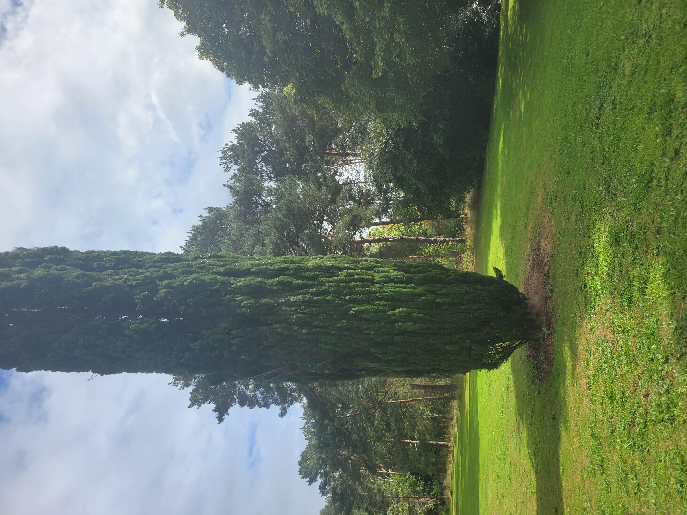
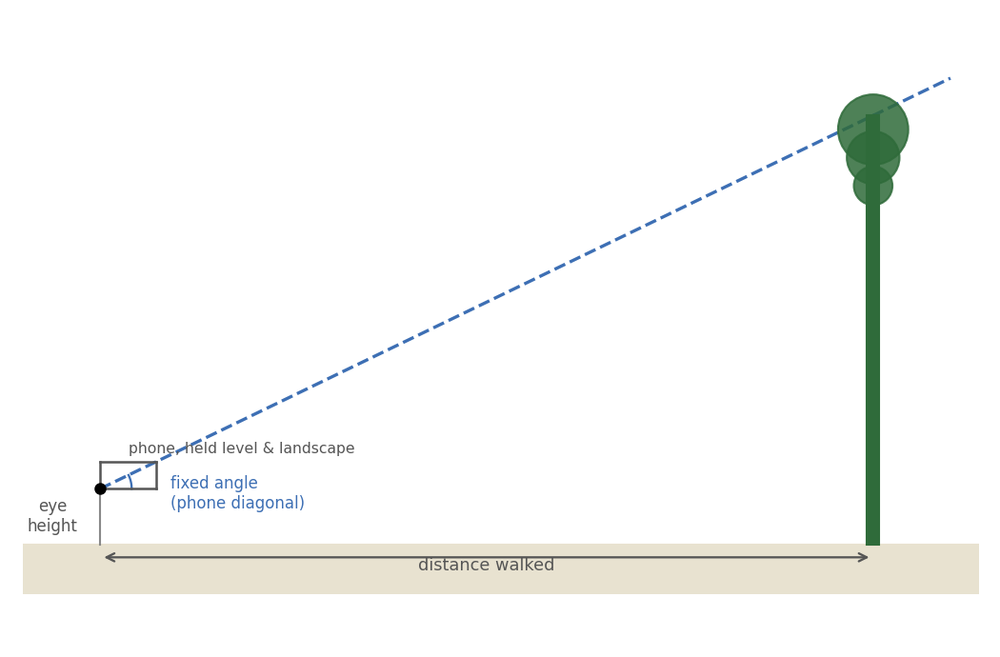

Suppose you need to measure the height of the tree in front of you, standing on the ground with nothing but your own two feet and the phone that you are using on this tour.

## The idea

Everything below comes down to one right-angled triangle:
- your eye,
-  the base of the tree directly below its top,
- and the top of the tree itself. 

If you can estimate the horizontal distance to the tree and the angle you have to look up through to see the top, basic trigonometry hands you the height:

$$\text{tree height} = \text{eye height} + \text{distance} \times \tan(\text{angle})$$

The distance is easy to estimate: pace it out. 

To estimate the angle accurately we would use a *clinometer*. However, we can get a good approximation using your phone!

Hold your phone flat, in landscape orientation, right beside your eye, with its bottom edge level and its near-bottom corner at your eye (see diagram).

Now you need to adjust your position so that the sight line across the diagonal of your phone extends to the tip of the tree.

Because the phone's shape never changes, that sightline always makes exactly the same angle with the horizontal -- fixed the moment you know its width and height, and the same every single time you use it:

$$\text{angle} = \arctan\!\left(\frac{\text{phone height}}{\text{phone width}}\right)$$




## Try it yourself

1. Stand facing the tree, somewhere with room to walk backwards.
2. Hold your phone flat, in landscape orientation, right beside your eye -- bottom edge level, near-bottom corner at your eye.
3. Sight past that corner, along the phone's diagonal, out towards the tree.
4. Stop looking at your phone and adjust your position by walking forwards or backwards.  Repeat from  Step 1 until the treetop lines up exactly along the diagonal line.
5.  Count the number of paces that you need to get to the base of the tree.
6. Enter your pace count, your own pace length, and your eye height into the calculator below.
7. Hit **Reveal the true height!** and see how close you got.

::: {#fig-trigonometry}
```{shinylive-python}
#| standalone: true
#| components: [viewer]
#| viewerHeight: 780

## file: app.py
import math

import matplotlib.pyplot as plt
import numpy as np

from shiny import App, Inputs, Outputs, Session, render, ui, reactive

# ---------------------------------------------------------------------------
# How this works.
#
# Hold your phone flat, in landscape orientation, right up beside your eye
# so its bottom edge is level and its near-bottom corner sits right at your
# eye. Look past that corner, along the phone's own diagonal, towards the
# tree. Because the phone's shape never changes, that sightline always makes
# the *same* angle with the horizontal:
#
#     angle = atan(phone_height / phone_width)
#
# Walk towards or away from the tree until the treetop lines up exactly
# along that diagonal. At that moment you, the base of the tree, and the
# treetop form a right triangle:
#
#     tan(angle) = (tree_height - eye_height) / distance_walked
#     tree_height = eye_height + distance_walked * tan(angle)
#
# distance_walked is simply paces * (your own pace length) -- see
# numeric_check_geometry.py for the algebra checks behind this.
# ---------------------------------------------------------------------------

# PLACEHOLDER -- replace with the real, confirmed height (in metres) of the
# Coastal Redwood (stop 29 on the Garden map) before this goes live.
TRUE_REDWOOD_HEIGHT_M = 35.0
TREE_NAME = "the tree"

PHONE_PRESETS = {
    "Compact phone (~14.0 x 6.7 cm)": (14.0, 6.7),
    "Standard phone (~14.7 x 7.1 cm)": (14.7, 7.1),
    "Large phone (~16.0 x 7.7 cm)": (16.0, 7.7),
    "Square card -- the classic 45 degree trick (10 x 10 cm)": (10.0, 10.0),
}
DEFAULT_PRESET = "Standard phone (~14.7 x 7.1 cm)"

SKY = "#eaf4fb"
GROUND = "#e8e2d0"
TREE_COLOR = "#2f6b3a"
TRUE_COLOR = "#b4442e"
SIGHT_COLOR = "#3d6fb4"


def sighting_angle_rad(width_cm, height_cm):
    return math.atan2(height_cm, width_cm)


def estimate_height_m(eye_height_cm, paces, pace_length_cm, angle_rad):
    distance_cm = paces * pace_length_cm
    height_cm = eye_height_cm + distance_cm * math.tan(angle_rad)
    return height_cm / 100.0, distance_cm / 100.0


def draw_diagram(ax, eye_height_m, distance_m, est_height_m, angle_rad,
                  reveal, true_height_m):
    max_h = max(est_height_m, true_height_m if reveal else 0, eye_height_m) * 1.15 + 1
    max_d = distance_m * 1.15 + 1

    ax.set_facecolor(SKY)
    ax.axhspan(-max_h * 0.06, 0, color=GROUND, zorder=0)

    # Sightline: from the eye, extended along the fixed diagonal angle, all
    # the way out to (and a little past) the estimated treetop.
    sight_len = distance_m / max(math.cos(angle_rad), 1e-6)
    sight_len *= 1.08
    ax.plot([0, sight_len * math.cos(angle_rad)],
             [eye_height_m, eye_height_m + sight_len * math.sin(angle_rad)],
             color=SIGHT_COLOR, linestyle="--", linewidth=1.4, zorder=3,
             label="sightline along phone diagonal")

    # Eye position and eye-height marker.
    ax.plot([0], [eye_height_m], marker="o", color="black", markersize=5, zorder=4)
    ax.plot([0, 0], [0, eye_height_m], color="#888888", linewidth=1.0, zorder=2)
    ax.annotate("eye height", xy=(0, eye_height_m / 2), xytext=(-max_d * 0.16, eye_height_m / 2),
                fontsize=8, color="#555555", va="center", ha="right")

    # Ground distance walked.
    ax.annotate("", xy=(distance_m, -max_h * 0.03), xytext=(0, -max_h * 0.03),
                arrowprops=dict(arrowstyle="<->", color="#555555", linewidth=1.0))
    ax.text(distance_m / 2, -max_h * 0.10, "distance walked (paces x pace length)",
            fontsize=8, color="#555555", ha="center")

    # Angle arc at the eye.
    arc_r = min(distance_m, max_h) * 0.22
    arc = np.linspace(0, angle_rad, 40)
    ax.plot(arc_r * np.cos(arc), eye_height_m + arc_r * np.sin(arc),
            color=SIGHT_COLOR, linewidth=1.0, zorder=3)
    ax.text(arc_r * 1.25, eye_height_m + arc_r * 0.55, "angle\n(fixed by\nphone shape)",
            fontsize=7.5, color=SIGHT_COLOR, ha="left", va="center")

    # Estimated tree.
    trunk_w = max_d * 0.01
    ax.add_patch(plt.Rectangle((distance_m - trunk_w / 2, 0), trunk_w, est_height_m,
                                color=TREE_COLOR, zorder=3))
    ax.plot([distance_m], [est_height_m], marker="^", color=TREE_COLOR, markersize=9, zorder=4)
    ax.plot([0, distance_m], [eye_height_m, est_height_m],
            color=TREE_COLOR, linewidth=0.0)  # no-op, keeps autoscale generous
    ax.text(distance_m, est_height_m, f"  your estimate: {est_height_m:.1f} m",
            fontsize=9, color=TREE_COLOR, va="bottom", ha="left", fontweight="bold")

    if reveal:
        ax.axhline(true_height_m, color=TRUE_COLOR, linestyle=":", linewidth=1.4, zorder=2)
        ax.text(max_d * 0.02, true_height_m, f"true height: {true_height_m:.1f} m  ",
                fontsize=9, color=TRUE_COLOR, va="bottom", ha="left", fontweight="bold")

    ax.set_xlim(-max_d * 0.22, max_d * 1.05)
    ax.set_ylim(-max_h * 0.14, max_h)
    ax.set_xlabel("horizontal distance (m)", fontsize=9)
    ax.set_ylabel("height (m)", fontsize=9)
    for spine in ("top", "right"):
        ax.spines[spine].set_visible(False)
    ax.set_aspect("equal", adjustable="box")


app_ui = ui.page_sidebar(
    ui.sidebar(
        ui.h5("1. Your phone"),
        ui.input_select("phone_preset", "Pick roughly your phone's shape",
                         choices=list(PHONE_PRESETS.keys()), selected=DEFAULT_PRESET),
        ui.input_numeric("width_cm", "Width, landscape (cm)", value=PHONE_PRESETS[DEFAULT_PRESET][0],
                          min=1, max=30, step=0.1),
        ui.input_numeric("height_cm", "Height, landscape (cm)", value=PHONE_PRESETS[DEFAULT_PRESET][1],
                          min=1, max=30, step=0.1),
        ui.hr(),
        ui.h5("2. You"),
        ui.input_numeric("eye_height_cm", "Your eye height (cm)", value=150, min=50, max=220, step=1),
        ui.markdown(
            "*Measure straight up from the ground to the corner of your eye "
            "-- or roughly your height minus about 10cm.*"
        ),
        ui.input_numeric("pace_length_cm", "Your pace length (cm)", value=75, min=20, max=150, step=1),
        ui.markdown(
            "*Walk 10 natural paces, measure the total distance, and divide "
            "by 10 to find your own pace length.*"
        ),
        ui.hr(),
        ui.h5("3. Your result"),
        ui.input_numeric("paces", f"Paces walked to line up with {TREE_NAME}",
                          value=40, min=0, max=300, step=1),
        ui.output_ui("summary"),
        ui.hr(),
        ui.input_action_button("reveal", "Reveal the true height!", class_="btn-primary"),
        ui.input_action_button("reset", "Try again"),
        width=380,
    ),
    ui.output_plot("diagram", height="480px"),
)


def server(input: Inputs, output: Outputs, session: Session):
    revealed = reactive.Value(False)

    @reactive.effect
    @reactive.event(input.phone_preset)
    def _sync_preset():
        w, h = PHONE_PRESETS[input.phone_preset()]
        ui.update_numeric("width_cm", value=w)
        ui.update_numeric("height_cm", value=h)

    @reactive.effect
    @reactive.event(input.reveal)
    def _do_reveal():
        revealed.set(True)

    @reactive.effect
    @reactive.event(input.reset)
    def _do_reset():
        revealed.set(False)

    def _compute():
        width = max(float(input.width_cm() or 0.1), 0.1)
        height = max(float(input.height_cm() or 0.1), 0.1)
        angle = sighting_angle_rad(width, height)
        eye_m = max(float(input.eye_height_cm() or 0), 0) / 100.0
        paces = max(float(input.paces() or 0), 0)
        pace_len = max(float(input.pace_length_cm() or 0.1), 0.1)
        est_m, dist_m = estimate_height_m(eye_m * 100.0, paces, pace_len, angle)
        return angle, eye_m, dist_m, est_m

    @output
    @render.plot
    def diagram():
        angle, eye_m, dist_m, est_m = _compute()
        fig, ax = plt.subplots(figsize=(7.2, 6.0))
        draw_diagram(ax, eye_m, max(dist_m, 0.01), max(est_m, 0.01), angle,
                     revealed.get(), TRUE_REDWOOD_HEIGHT_M)
        fig.tight_layout()
        return fig

    @output
    @render.ui
    def summary():
        angle, eye_m, dist_m, est_m = _compute()
        lines = [
            f"**Sighting angle:** {math.degrees(angle):.1f} deg (fixed by your phone's shape)",
            f"**Distance walked:** {dist_m:.1f} m",
            f"**Your estimated height:** {est_m:.1f} m",
        ]
        if revealed.get():
            error_m = est_m - TRUE_REDWOOD_HEIGHT_M
            pct = abs(error_m) / TRUE_REDWOOD_HEIGHT_M * 100.0
            if pct < 5:
                verdict = "Excellent -- spot on!"
            elif pct < 15:
                verdict = "Great estimate!"
            elif pct < 30:
                verdict = "Good ballpark!"
            else:
                verdict = "A fair way off -- check your pace length and try again?"
            direction = "over" if error_m > 0 else "under"
            lines += [
                f"**{TREE_NAME.capitalize()}'s true height:** {TRUE_REDWOOD_HEIGHT_M:.1f} m",
                f"You were **{abs(error_m):.1f} m** ({pct:.0f}%) **{direction}** -- {verdict}",
            ]
        return ui.markdown("\n\n".join(lines))


app = App(app_ui, server)
```

:::

A note on accuracy: the trigonometry here is exact -- given a truly level sightline, a correctly measured pace length and eye height, and a phone held steadily, this method recovers the real height. In practice, all four of those introduce small errors (which is exactly why it's a *good estimate*, not a laser rangefinder), so don't be surprised if your first go is off by a metre or two either way -- try pacing out your pace length carefully first, and see if your estimate improves.
